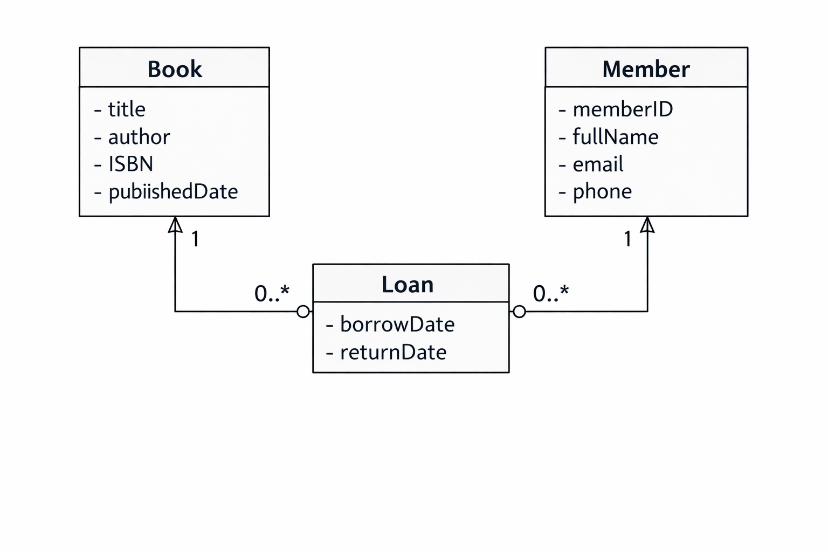
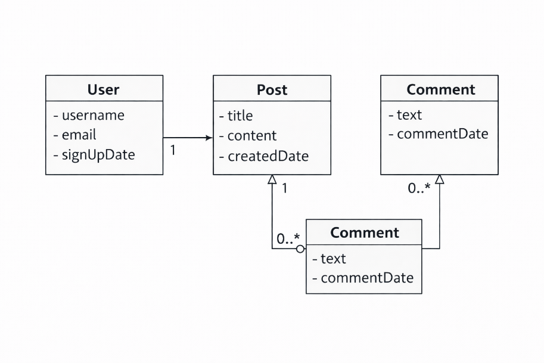
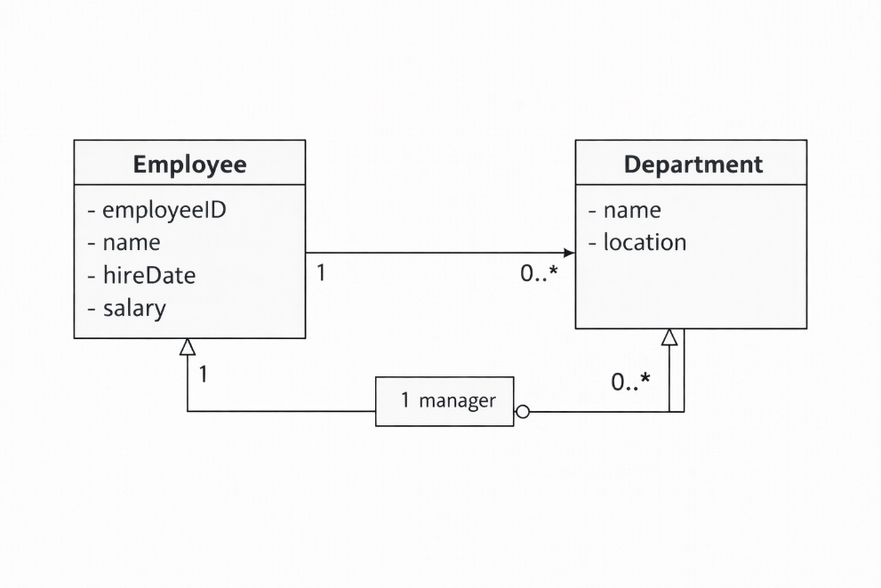
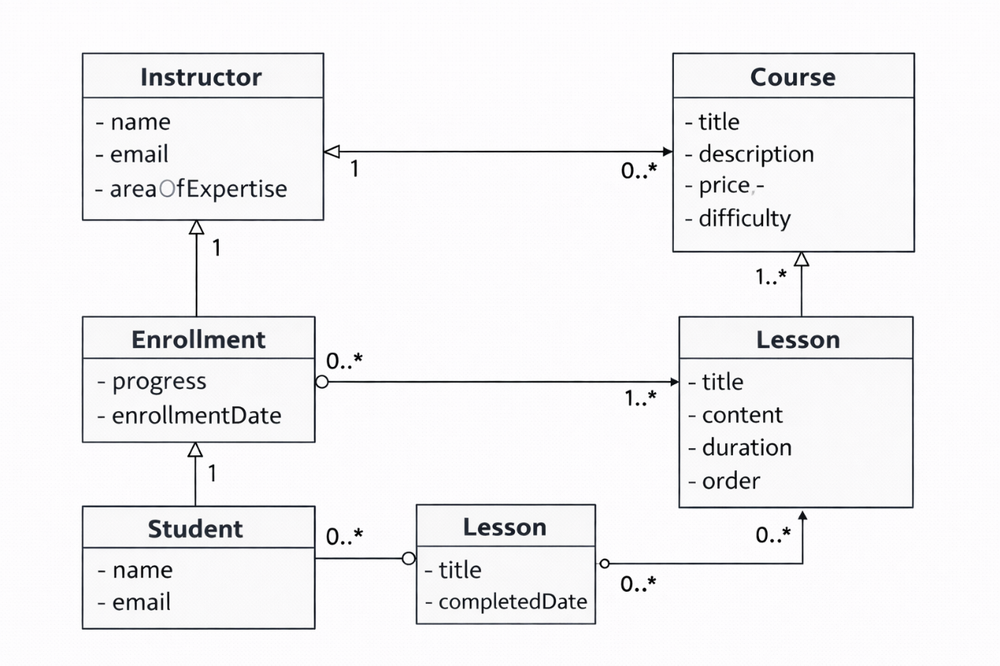
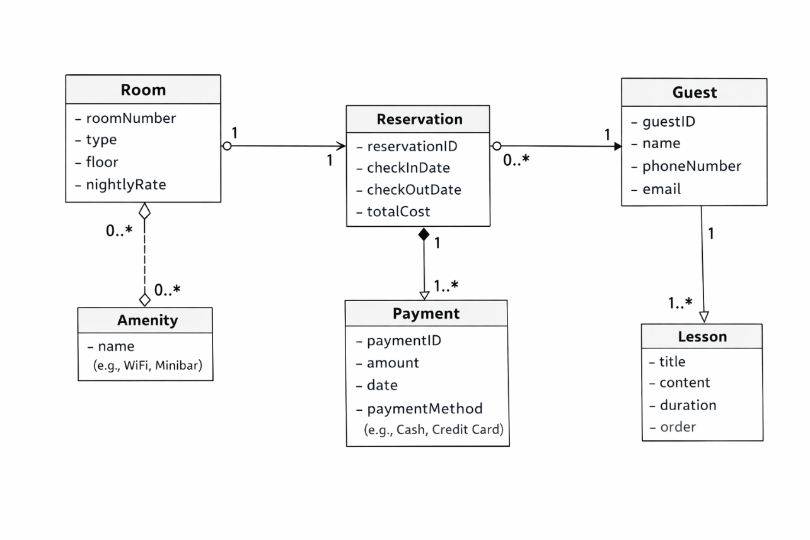
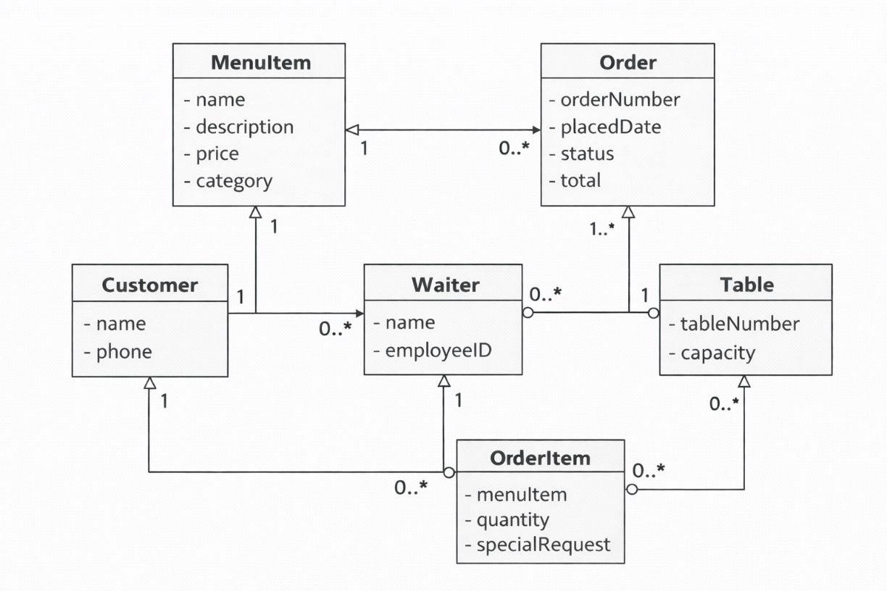
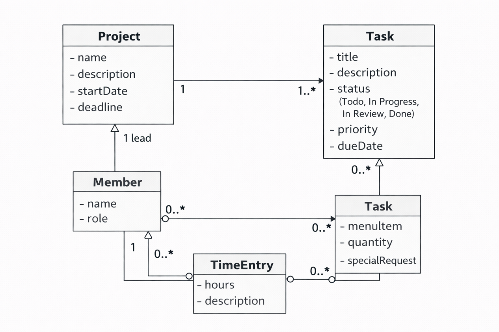
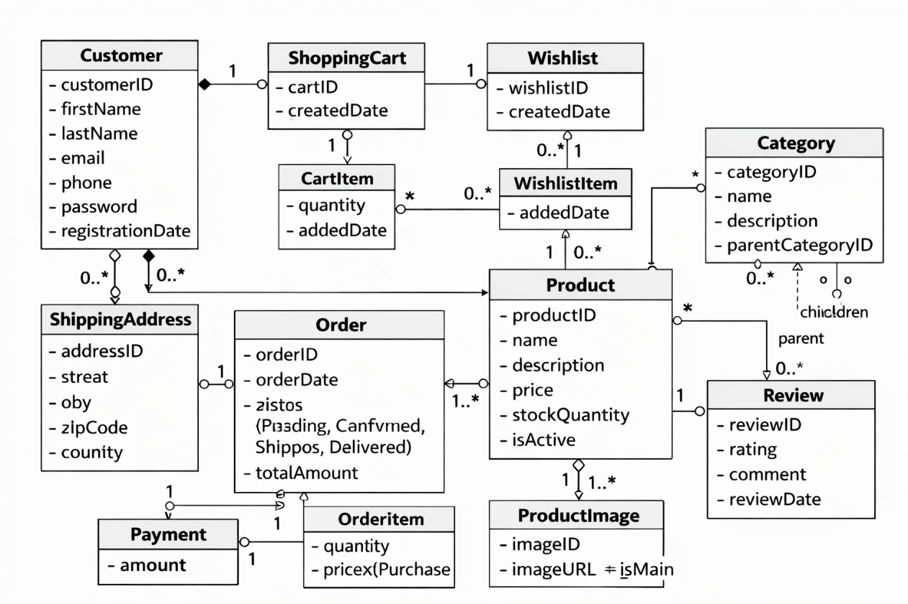
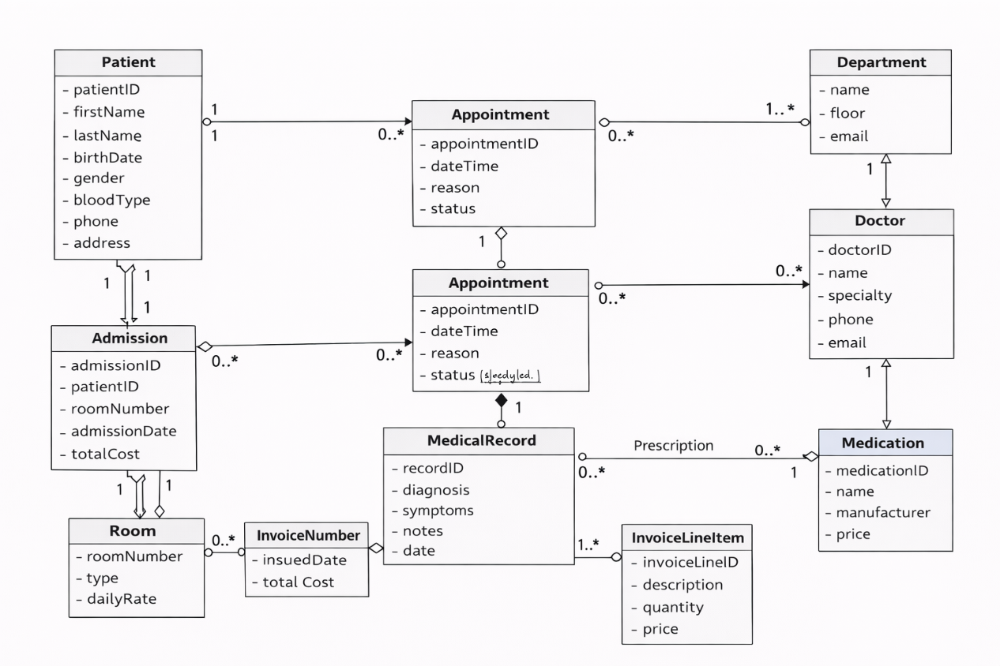
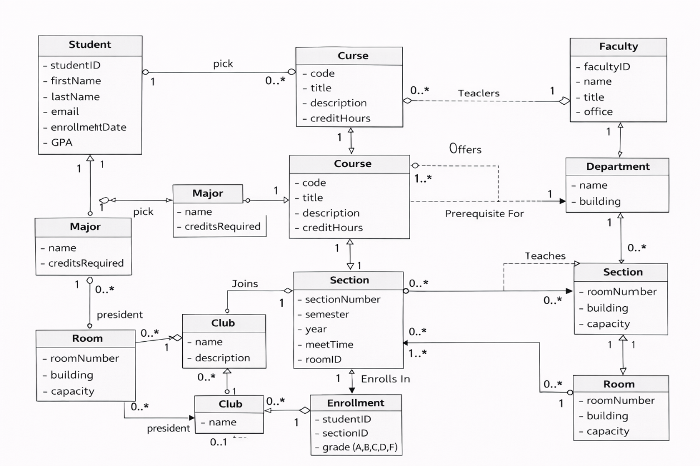

# ChatGPT DALL-E — Class Diagram Results

Generated using ChatGPT web interface (chatgpt.com) with GPT-5.2 Thinking + DALL-E image generation. Prompt: "Using DALL-E, generate an image of a UML class diagram. Do not use code or Mermaid. Draw the actual image showing classes as boxes with attributes inside, and lines connecting them for relationships."

**Note:** DALL-E generates images directly — no source code is available.

## TC01: Library: Library Management

### Generated Diagram

---

## TC02: Blog: Blog Platform

### Generated Diagram

---

## TC03: Employee: Employee & Department

### Generated Diagram

---

## TC04: ELearning: E-Learning Platform

### Generated Diagram

---

## TC05: Hotel: Hotel Booking

### Generated Diagram

---

## TC06: Restaurant: Restaurant Ordering

### Generated Diagram

---

## TC07: ProjectTasks: Project Task Tracking

### Generated Diagram

---

## TC08: OnlineStore: Online Store

### Generated Diagram

---

## TC09: Hospital: Hospital Management

### Generated Diagram

---

## TC10: University: University Registration

### Generated Diagram

---
