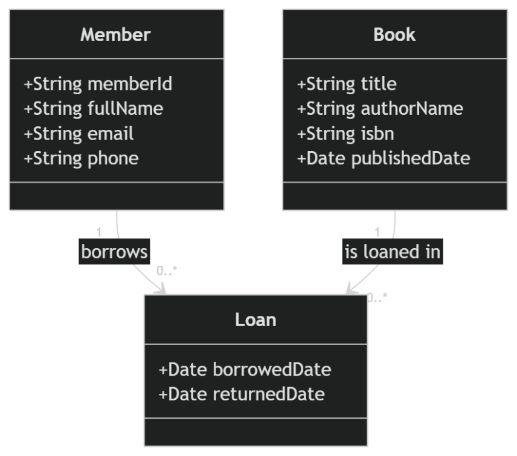
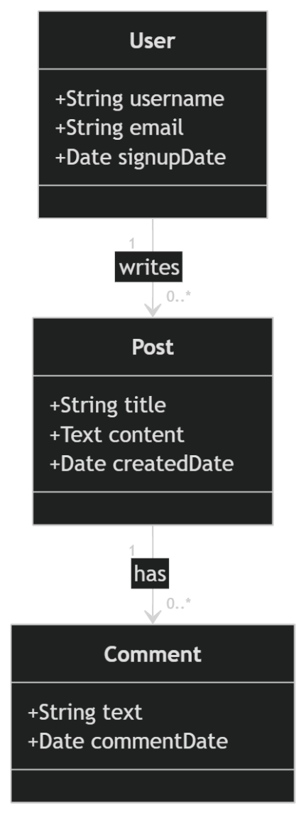
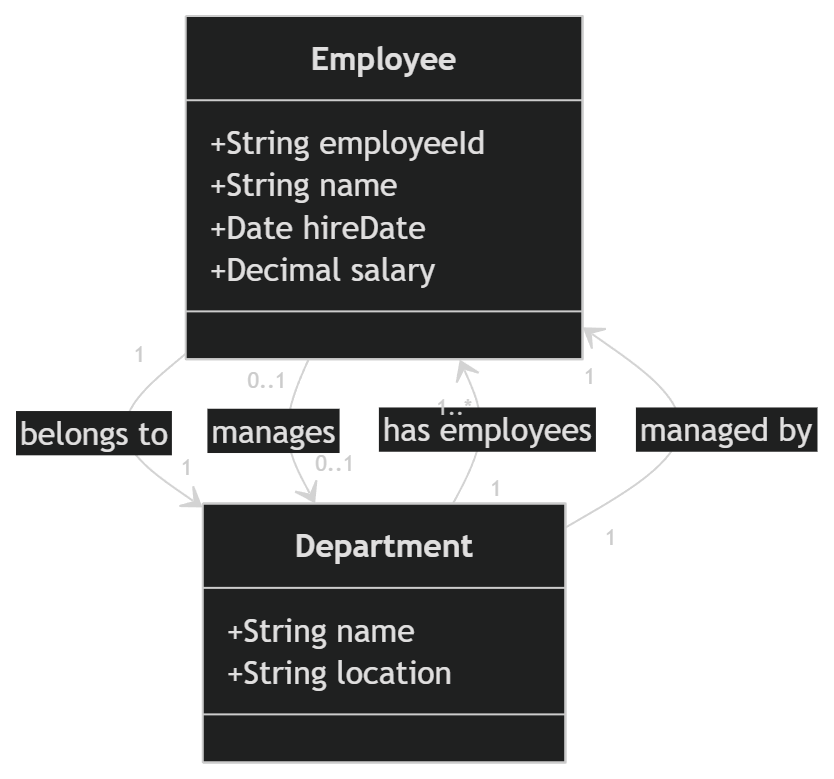
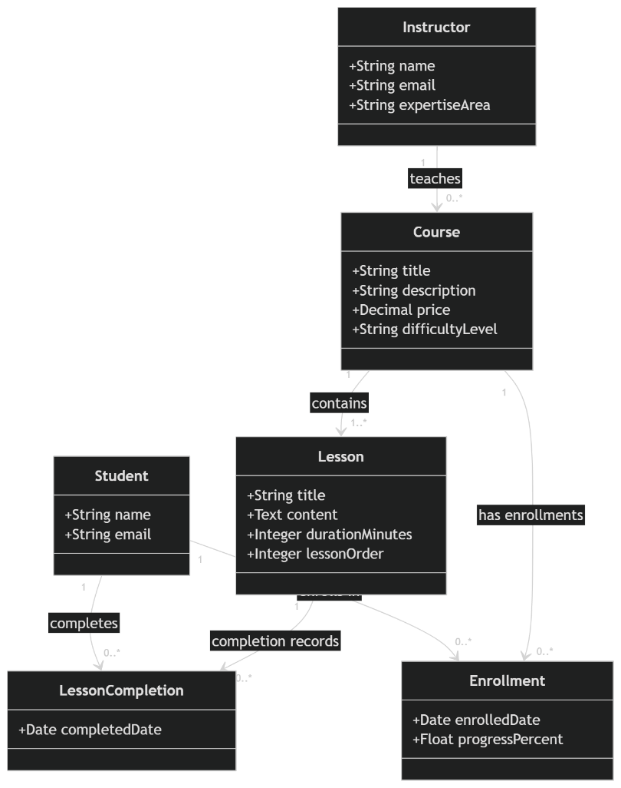
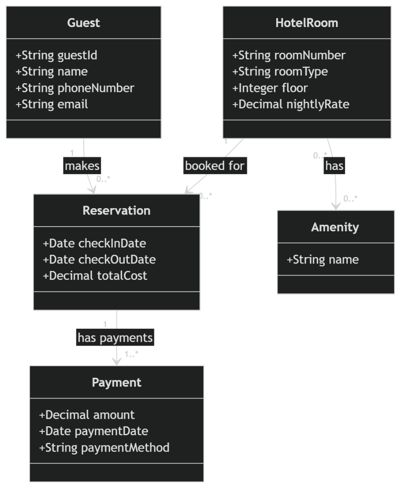
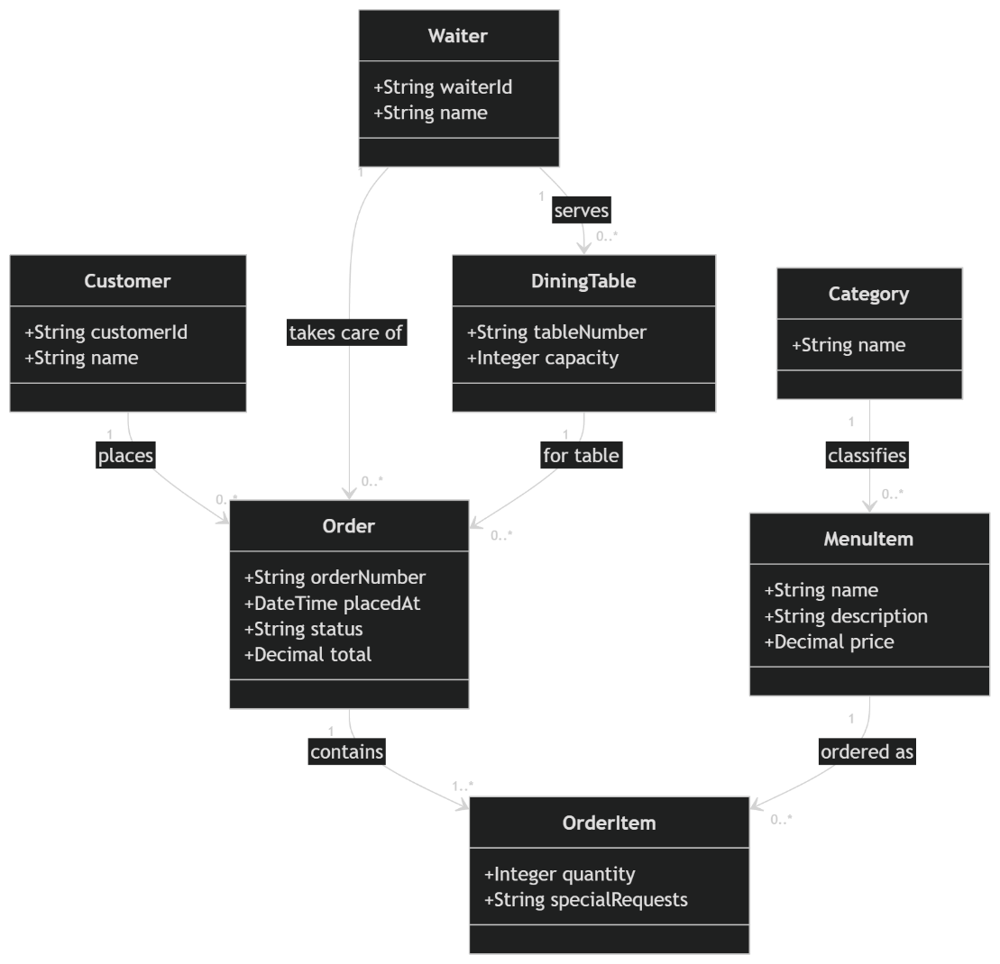
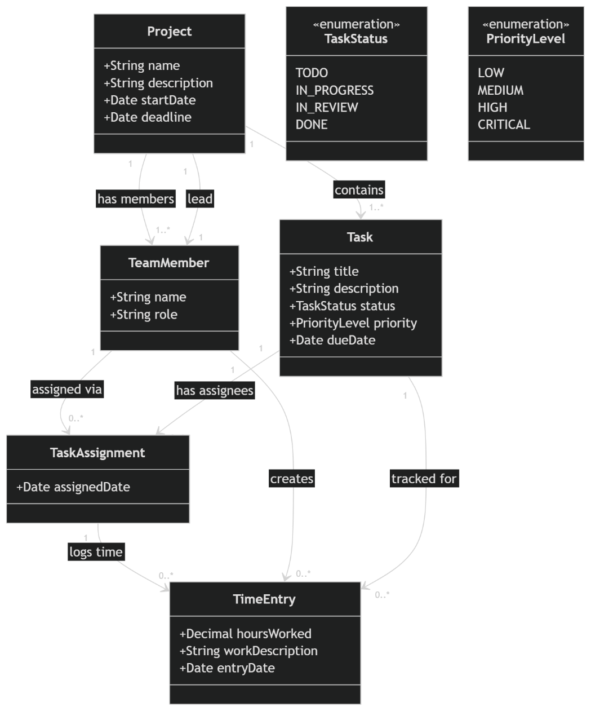
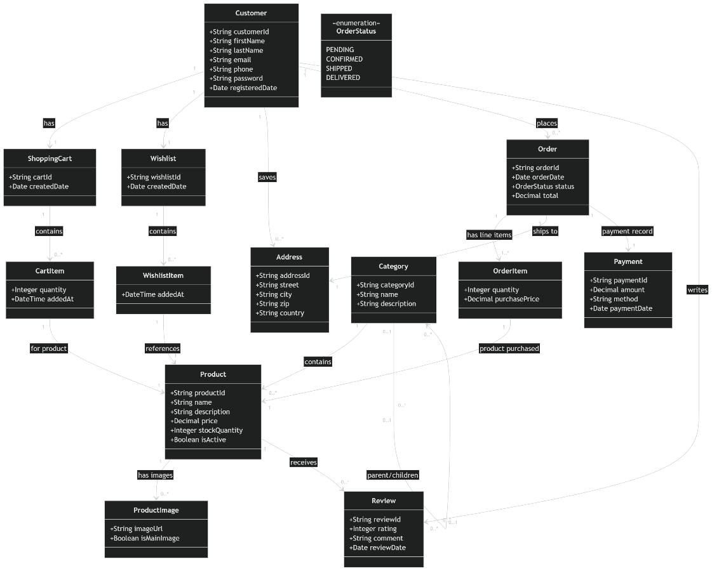
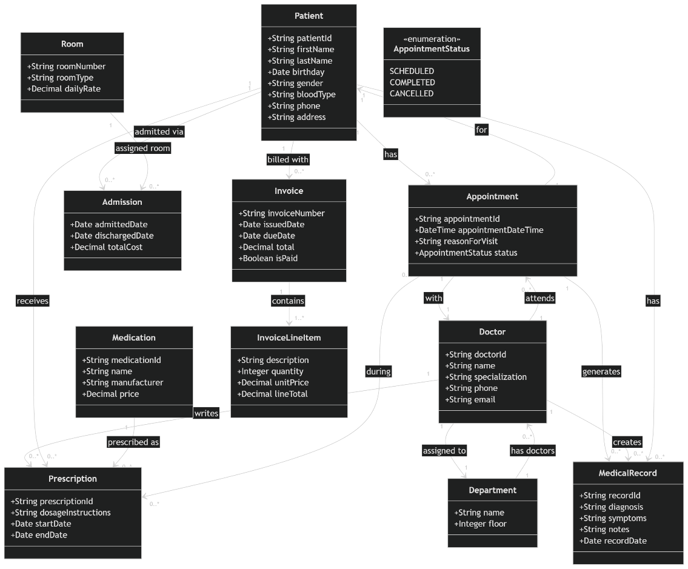
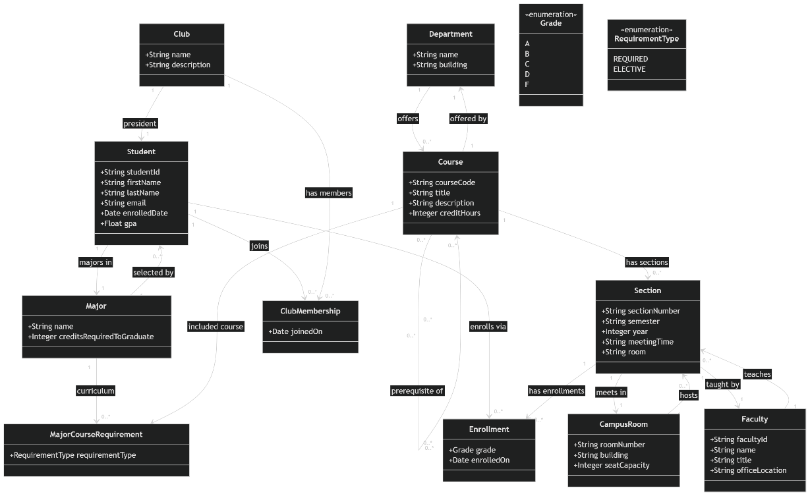

# ChatGPT Mermaid — Class Diagram Results

Generated using ChatGPT web interface (chatgpt.com) with GPT-5.2 Thinking, prompted to generate Mermaid diagram code. ChatGPT generated Mermaid code which was rendered via its built-in renderer.

**Note:** Only rendered images are available — Mermaid source code was not captured from the ChatGPT interface.

## TC01: Library: Library Management

### Generated Diagram

---

## TC02: Blog: Blog Platform

### Generated Diagram

---

## TC03: Employee: Employee & Department

### Generated Diagram

---

## TC04: ELearning: E-Learning Platform

### Generated Diagram

---

## TC05: Hotel: Hotel Booking

### Generated Diagram

---

## TC06: Restaurant: Restaurant Ordering

### Generated Diagram

---

## TC07: ProjectTasks: Project Task Tracking

### Generated Diagram

---

## TC08: OnlineStore: Online Store

### Generated Diagram

---

## TC09: Hospital: Hospital Management

### Generated Diagram

---

## TC10: University: University Registration

### Generated Diagram

---
