# ChatGPT PlantUML — Class Diagram Results

Generated using ChatGPT web interface (chatgpt.com) with GPT-5.2 Thinking, prompted: "Generate PlantUML code for a class diagram based on these requirements. Return only the code between @startuml and @enduml." Code was then rendered via plantuml.com.

## TC01: Library: Library Management

### PlantUML Code

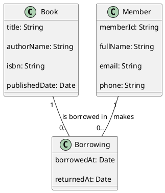

### Generated Diagram

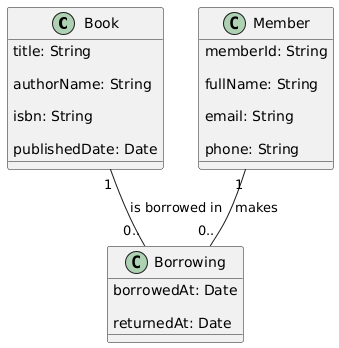

---

## TC02: Blog: Blog Platform

### PlantUML Code

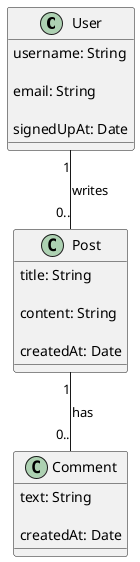

### Generated Diagram

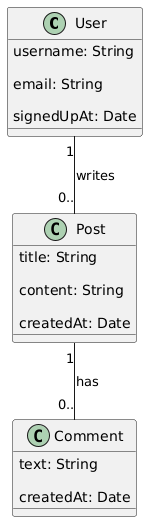

---

## TC03: Employee: Employee & Department

### PlantUML Code

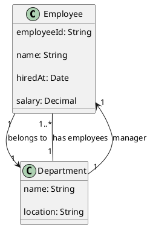

### Generated Diagram

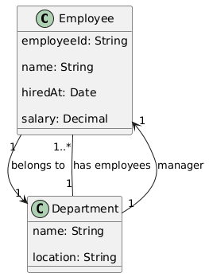

---

## TC04: ELearning: E-Learning Platform

### PlantUML Code

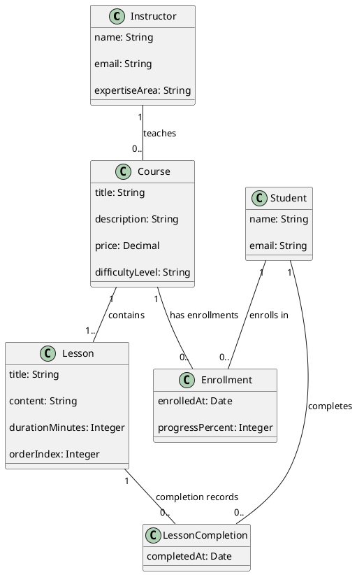

### Generated Diagram

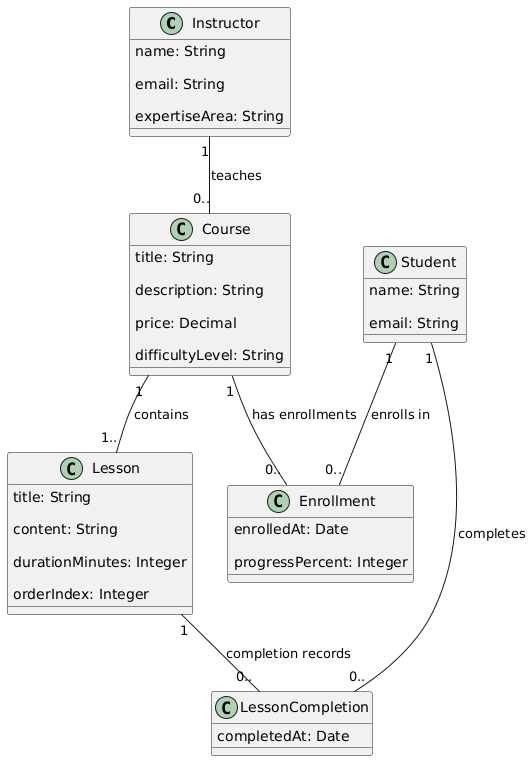

---

## TC05: Hotel: Hotel Booking

### PlantUML Code

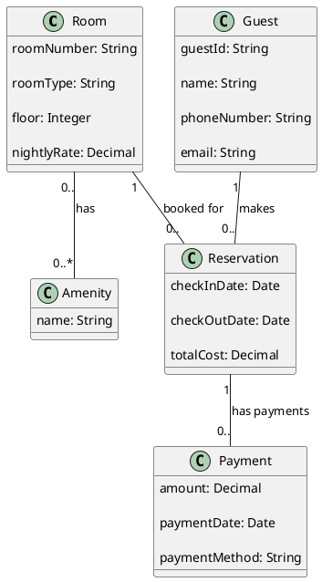

### Generated Diagram

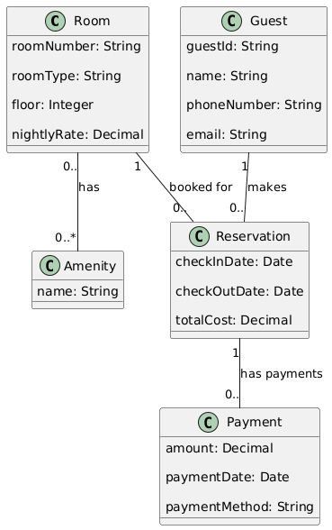

---

## TC06: Restaurant: Restaurant Ordering

### PlantUML Code

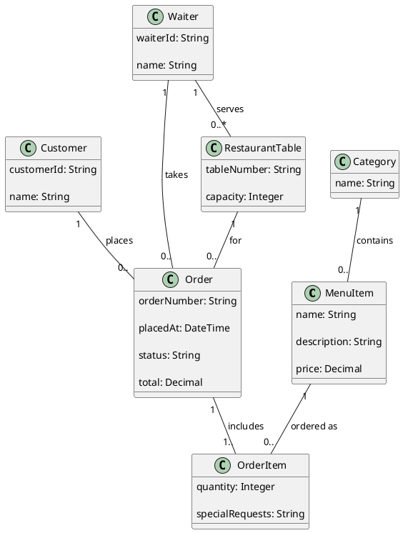

### Generated Diagram

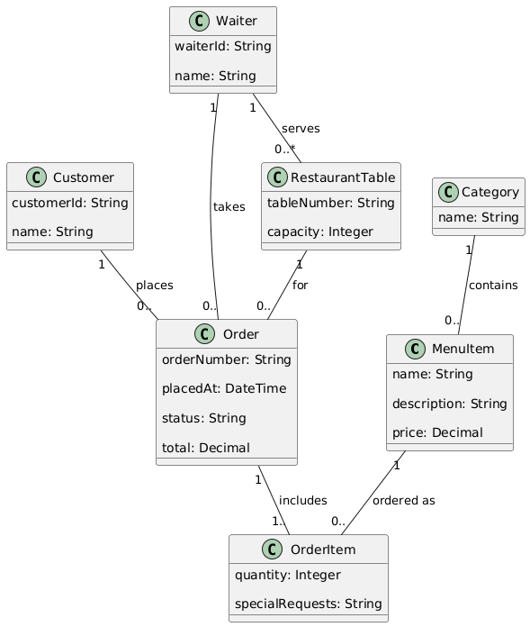

---

## TC07: ProjectTasks: Project Task Tracking

### PlantUML Code

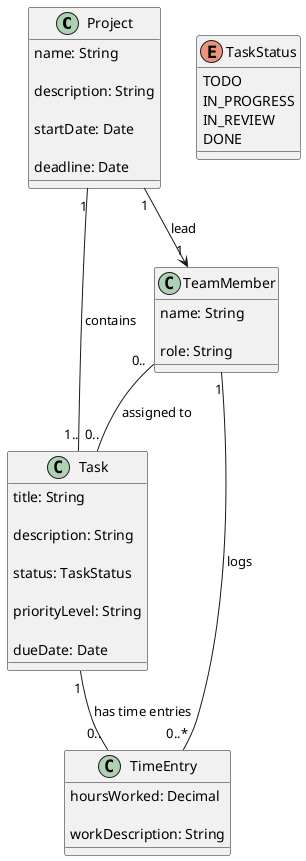

### Generated Diagram

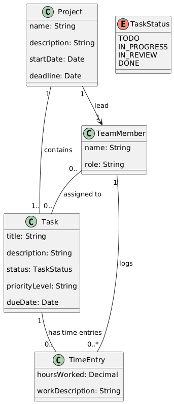

---

## TC08: OnlineStore: Online Store

### PlantUML Code

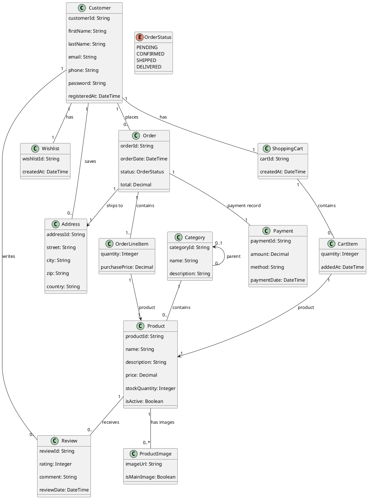

### Generated Diagram

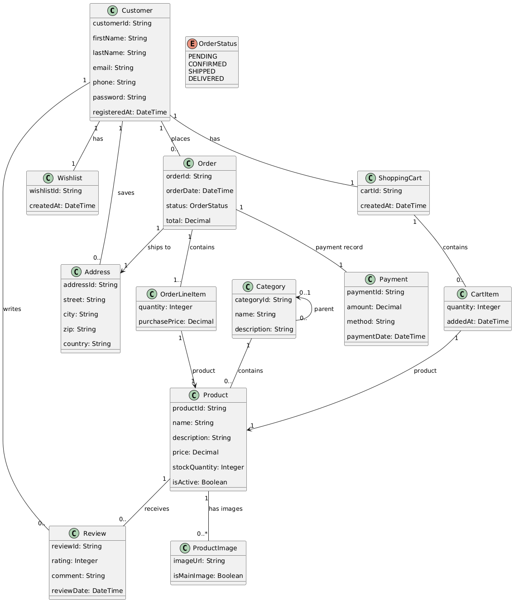

---

## TC09: Hospital: Hospital Management

### PlantUML Code

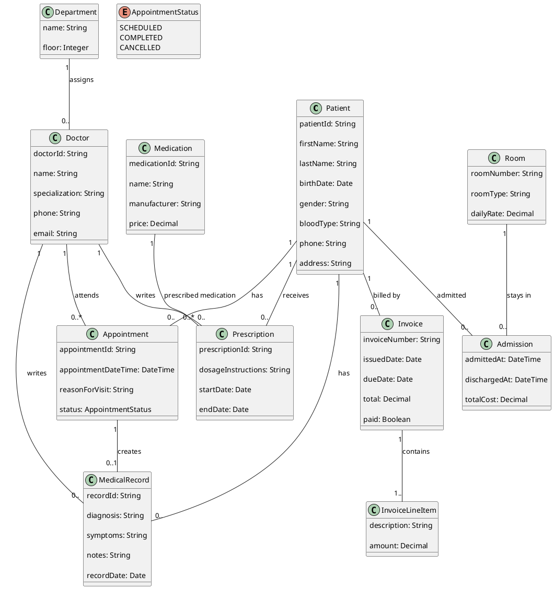

### Generated Diagram

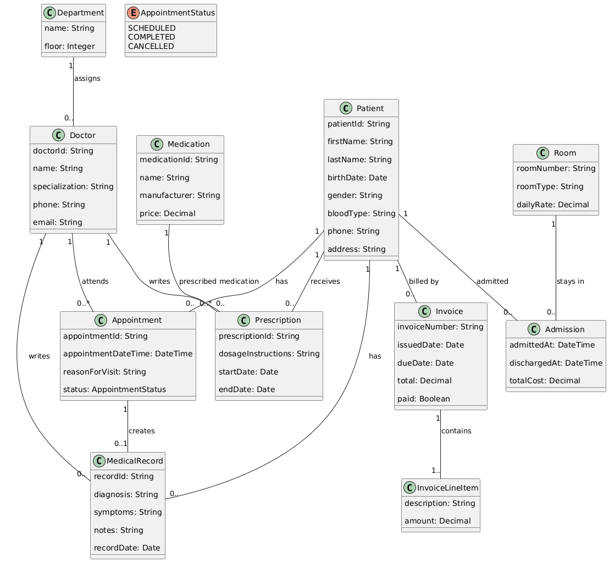

---

## TC10: University: University Registration

### PlantUML Code

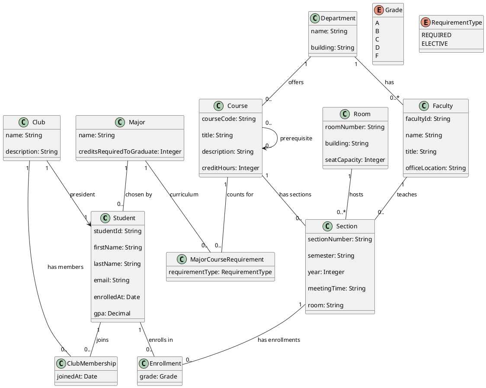

### Generated Diagram

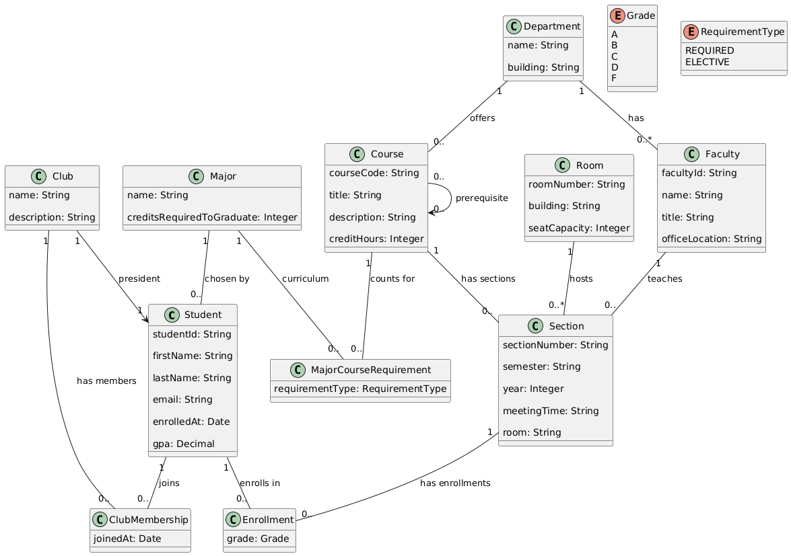

---
