# UMLReq System — Class Diagram Results

Generated using GPT-4o (gpt-4o-2024-11-20) via OpenAI API with temperature=0.3, top_p=1.0, RAG grounding in PlantUML documentation, and methodology-aware prompts (Larman's mapmaker principle).

## TC01: Library: Library Management

### PlantUML Code

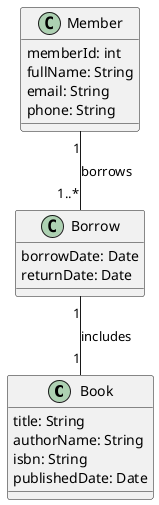

### Generated Diagram

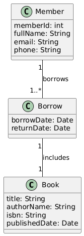

---

## TC02: Blog: Blog Platform

### PlantUML Code

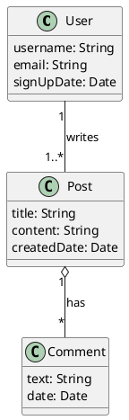

### Generated Diagram

---

## TC03: Employee: Employee & Department

### PlantUML Code

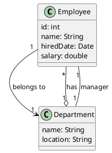

### Generated Diagram

---

## TC04: ELearning: E-Learning Platform

### PlantUML Code

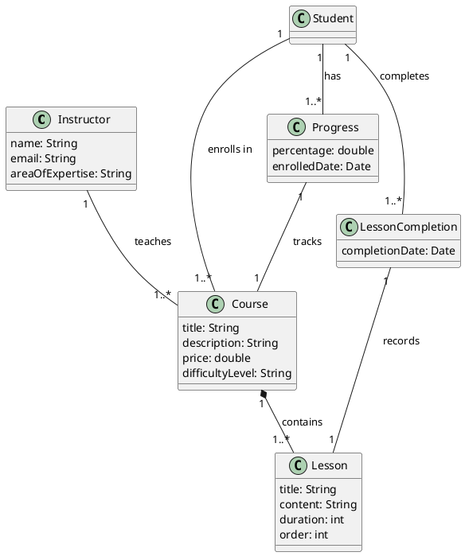

### Generated Diagram

---

## TC05: Hotel: Hotel Booking

### PlantUML Code

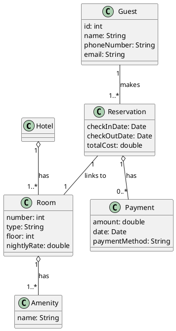

### Generated Diagram

---

## TC06: Restaurant: Restaurant Ordering

### PlantUML Code

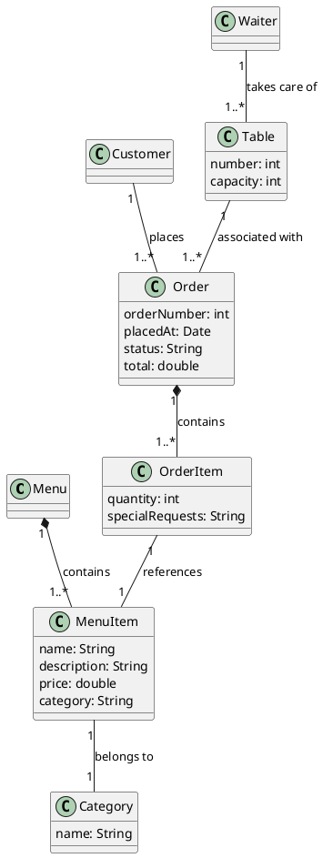

### Generated Diagram

---

## TC07: ProjectTasks: Project Task Tracking

### PlantUML Code

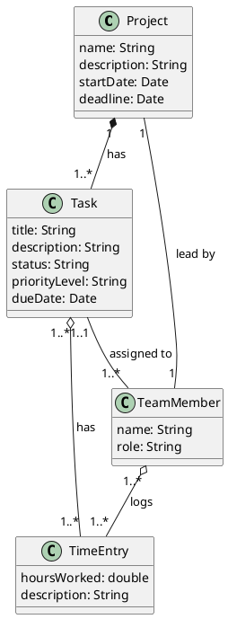

### Generated Diagram

---

## TC08: OnlineStore: Online Store

### PlantUML Code

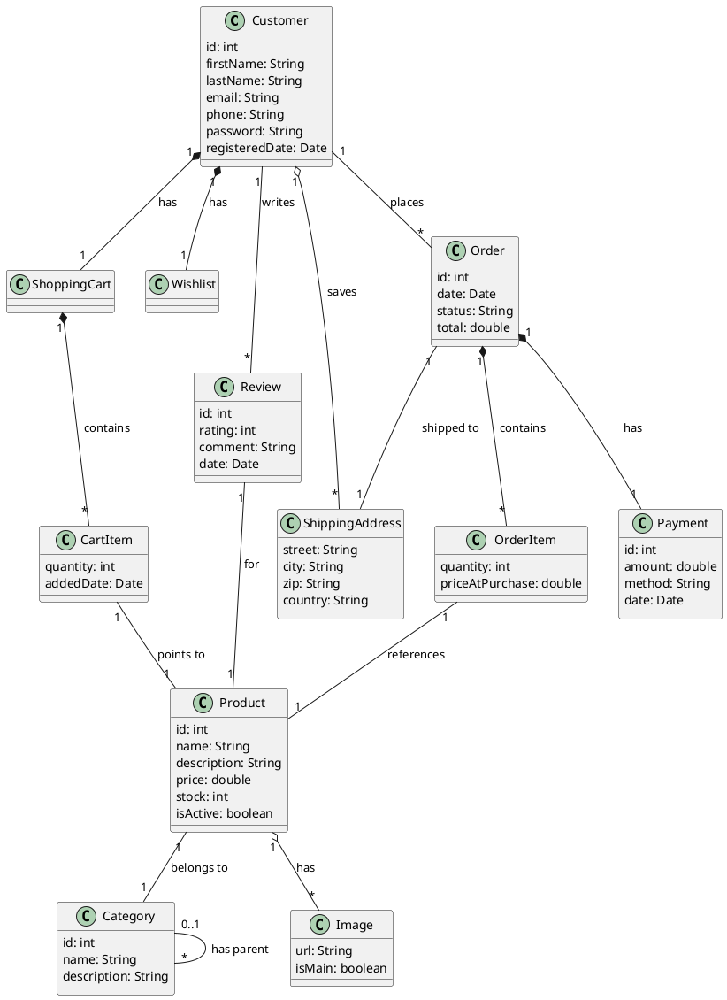

### Generated Diagram

---

## TC09: Hospital: Hospital Management

### PlantUML Code

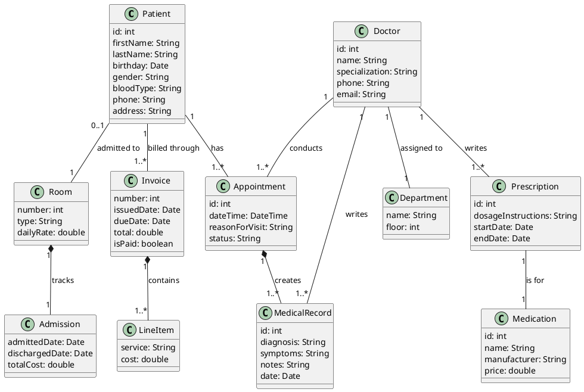

### Generated Diagram

---

## TC10: University: University Registration

### PlantUML Code

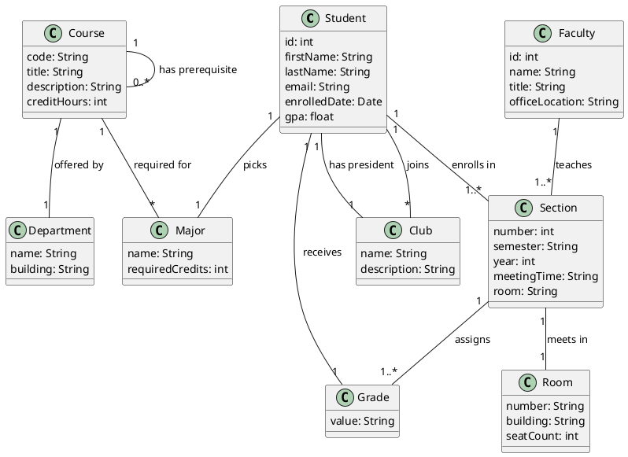

### Generated Diagram

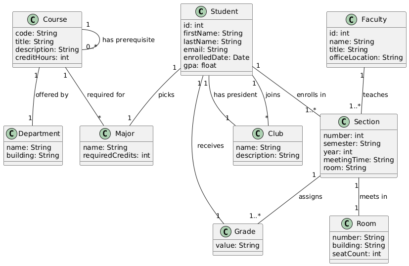

---
