# Multi-Run Stability Data

75 generation runs (15 test cases × 5 runs each) with identical requirements and parameters.

**Parameters**: model=gpt-4o-2024-11-20, temperature=0.3, top_p=1.0

**Purpose**: Assess output stability and consistency despite LLM non-determinism.

## TC01: Library: Library Management (Class Diagram)

### Run 1

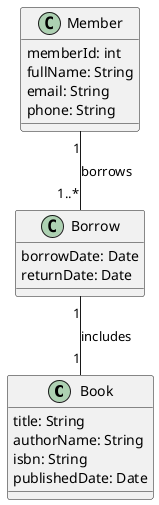
```plantuml
@startuml

class Book {
  title: String
  authorName: String
  isbn: String
  publishedDate: Date
}

class Member {
  memberId: int
  fullName: String
  email: String
  phone: String
}

class Borrow {
  borrowDate: Date
  returnDate: Date
}

Member "1" -- "1..*" Borrow : borrows
Borrow "1" -- "1" Book : includes

@enduml
```

### Run 2

```plantuml
@startuml

class Book {
  title: String
  authorName: String
  isbn: String
  publishedDate: Date
}

class Member {
  memberId: int
  fullName: String
  email: String
  phone: String
}

class Borrow {
  borrowDate: Date
  returnDate: Date
}

Member "1" -- "1..*" Borrow : borrows
Borrow "1" -- "1" Book : includes

@enduml
```

### Run 3

```plantuml
@startuml

class Book {
  title: String
  authorName: String
  isbn: String
  publishedDate: Date
}

class Member {
  memberId: int
  fullName: String
  email: String
  phone: String
}

class Borrow {
  borrowDate: Date
  returnDate: Date
}

Member "1" -- "*" Borrow : borrows
Borrow "1" -- "1" Book : includes

@enduml
```

### Run 4

```plantuml
@startuml

class Book {
  title: String
  authorName: String
  isbn: String
  publishedDate: Date
}

class Member {
  memberId: int
  fullName: String
  email: String
  phone: String
}

class Borrow {
  borrowDate: Date
  returnDate: Date
}

Member "1" -- "*" Borrow : borrows
Borrow "1" -- "1" Book : includes

@enduml
```

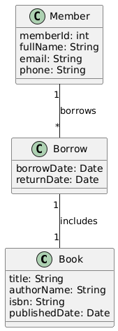

### Run 5

```plantuml
@startuml

class Book {
  title: String
  authorName: String
  isbn: String
  publishedDate: Date
}

class Member {
  memberId: int
  fullName: String
  email: String
  phone: String
}

class Borrow {
  borrowDate: Date
  returnDate: Date
}

Member "1" -- "1..*" Borrow : borrows
Borrow "1" -- "1" Book : includes

@enduml
```

### Structural Consistency: **CONSISTENT**

All 5 runs produce structurally identical output (same classes, attributes, and relationships).

---

## TC02: Blog: Blog Platform (Class Diagram)

### Run 1

```plantuml
@startuml

class User {
  username: String
  email: String
  signUpDate: Date
}

class Post {
  title: String
  content: String
  createdDate: Date
}

class Comment {
  text: String
  date: Date
}

User "1" -- "1..*" Post : writes
Post "1" o-- "*" Comment : has

@enduml
```

### Run 2

```plantuml
@startuml

class User {
  username: String
  email: String
  signUpDate: Date
}

class Post {
  title: String
  content: String
  createdDate: Date
}

class Comment {
  text: String
  date: Date
}

User "1" -- "1..*" Post : writes
Post "1" o-- "*" Comment : has

@enduml
```

### Run 3

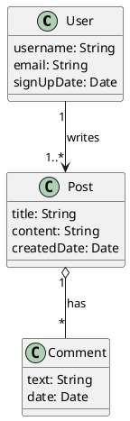
```plantuml
@startuml

class User {
  username: String
  email: String
  signUpDate: Date
}

class Post {
  title: String
  content: String
  createdDate: Date
}

class Comment {
  text: String
  date: Date
}

User "1" --> "1..*" Post : writes
Post "1" o-- "*" Comment : has

@enduml
```

### Run 4

```plantuml
@startuml

class User {
  username: String
  email: String
  signUpDate: Date
}

class Post {
  title: String
  content: String
  createdDate: Date
}

class Comment {
  text: String
  date: Date
}

User "1" --> "1..*" Post : writes
Post "1" o-- "*" Comment : has

@enduml
```

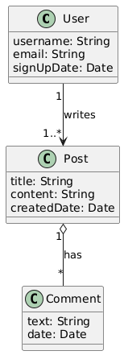

### Run 5

```plantuml
@startuml

class User {
  username: String
  email: String
  signUpDate: Date
}

class Post {
  title: String
  content: String
  createdDate: Date
}

class Comment {
  text: String
  date: Date
}

User "1" -- "1..*" Post : writes
Post "1" o-- "*" Comment : has

@enduml
```

### Structural Consistency: **CONSISTENT**

All 5 runs produce structurally identical output (same classes, attributes, and relationships).

---

## TC03: Employee: Employee & Department (Class Diagram)

### Run 1

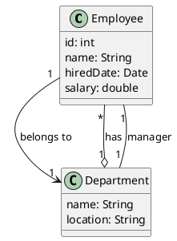
```plantuml
@startuml

class Employee {
  id: int
  name: String
  hiredDate: Date
  salary: double
}

class Department {
  name: String
  location: String
}

Employee "1" --> "1" Department : belongs to
Department "1" o-- "*" Employee : has
Department "1" -- "1" Employee : manager

@enduml
```

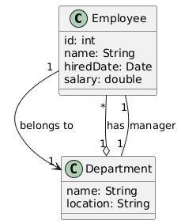

### Run 2

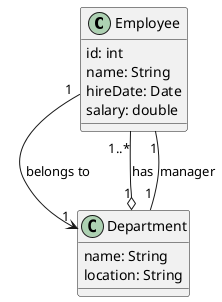
```plantuml
@startuml

class Employee {
  id: int
  name: String
  hireDate: Date
  salary: double
}

class Department {
  name: String
  location: String
}

Employee "1" --> "1" Department : belongs to
Department "1" o-- "1..*" Employee : has
Department "1" -- "1" Employee : manager

@enduml
```

### Run 3

```plantuml
@startuml

class Employee {
  id: int
  name: String
  hireDate: Date
  salary: double
}

class Department {
  name: String
  location: String
}

Employee "1" --> "1" Department : belongs to
Department "1" o-- "*" Employee : has
Department "1" --> "1" Employee : manager

@enduml
```

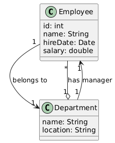

### Run 4

```plantuml
@startuml

class Employee {
  id: int
  name: String
  hireDate: Date
  salary: double
}

class Department {
  name: String
  location: String
}

Employee "1" --> "1" Department : belongs to
Department "1" o-- "1..*" Employee : has
Department "1" -- "1" Employee : manager

@enduml
```

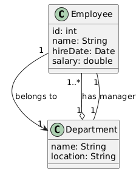

### Run 5

```plantuml
@startuml

class Employee {
  id: int
  name: String
  hireDate: Date
  salary: double
}

class Department {
  name: String
  location: String
}

Employee "1" --> "1" Department : belongs to
Department "1" o-- "*" Employee : has
Department "1" --> "1" Employee : manager

@enduml
```

### Structural Consistency: **INCONSISTENT**

* Run 2: Employee attributes differ (added: ['hireDate'], removed: ['hiredDate'])
* Run 3: Employee attributes differ (added: ['hireDate'], removed: ['hiredDate'])
* Run 4: Employee attributes differ (added: ['hireDate'], removed: ['hiredDate'])
* Run 5: Employee attributes differ (added: ['hireDate'], removed: ['hiredDate'])

---

## TC04: ELearning: E-Learning Platform (Class Diagram)

### Run 1

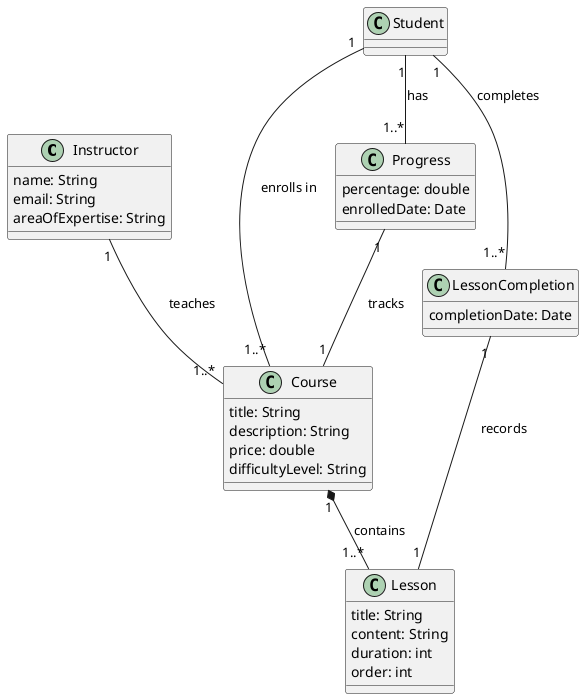
```plantuml
@startuml

class Instructor {
  name: String
  email: String
  areaOfExpertise: String
}

class Course {
  title: String
  description: String
  price: double
  difficultyLevel: String
}

class Student

class Progress {
  percentage: double
  enrolledDate: Date
}

class Lesson {
  title: String
  content: String
  duration: int
  order: int
}

class LessonCompletion {
  completionDate: Date
}

Instructor "1" -- "1..*" Course : teaches
Student "1" -- "1..*" Course : enrolls in
Course "1" *-- "1..*" Lesson : contains
Student "1" -- "1..*" Progress : has
Progress "1" -- "1" Course : tracks
Student "1" -- "1..*" LessonCompletion : completes
LessonCompletion "1" -- "1" Lesson : records

@enduml
```

### Run 2

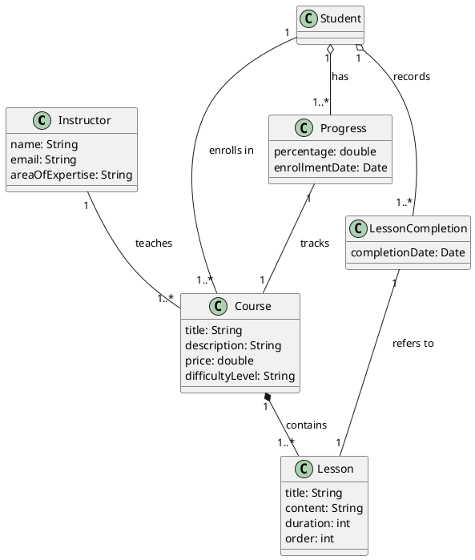
```plantuml
@startuml

class Instructor {
  name: String
  email: String
  areaOfExpertise: String
}

class Course {
  title: String
  description: String
  price: double
  difficultyLevel: String
}

class Student

class Progress {
  percentage: double
  enrollmentDate: Date
}

class Lesson {
  title: String
  content: String
  duration: int
  order: int
}

class LessonCompletion {
  completionDate: Date
}

Instructor "1" -- "1..*" Course : teaches
Course "1" *-- "1..*" Lesson : contains
Student "1" -- "1..*" Course : enrolls in
Student "1" o-- "1..*" Progress : has
Progress "1" -- "1" Course : tracks
Student "1" o-- "1..*" LessonCompletion : records
LessonCompletion "1" -- "1" Lesson : refers to

@enduml
```

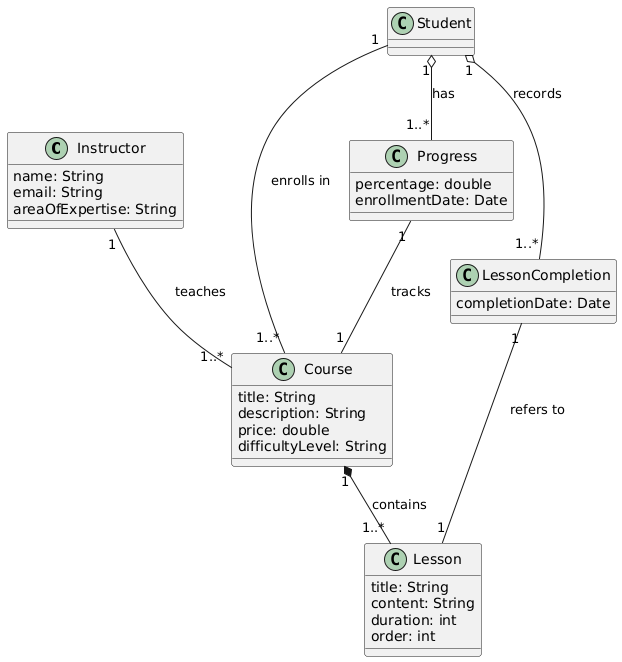

### Run 3

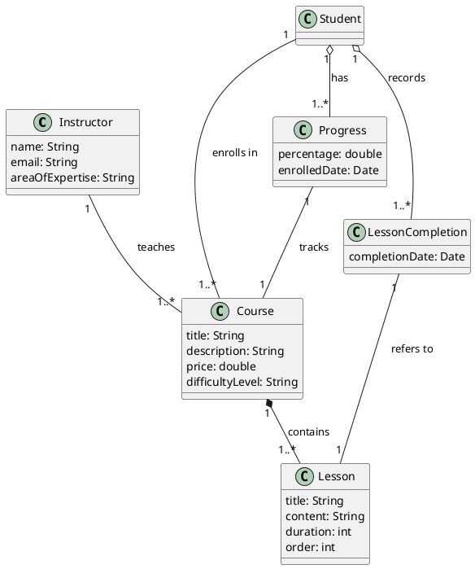
```plantuml
@startuml

class Instructor {
  name: String
  email: String
  areaOfExpertise: String
}

class Course {
  title: String
  description: String
  price: double
  difficultyLevel: String
}

class Student

class Progress {
  percentage: double
  enrolledDate: Date
}

class Lesson {
  title: String
  content: String
  duration: int
  order: int
}

class LessonCompletion {
  completionDate: Date
}

Instructor "1" -- "1..*" Course : teaches
Course "1" *-- "1..*" Lesson : contains
Student "1" -- "1..*" Course : enrolls in
Student "1" o-- "1..*" Progress : has
Progress "1" -- "1" Course : tracks
Student "1" o-- "1..*" LessonCompletion : records
LessonCompletion "1" -- "1" Lesson : refers to

@enduml
```

### Run 4

```plantuml
@startuml

class Instructor {
  name: String
  email: String
  areaOfExpertise: String
}

class Course {
  title: String
  description: String
  price: double
  difficultyLevel: String
}

class Student

class Progress {
  percentage: double
  enrolledDate: Date
}

class Lesson {
  title: String
  content: String
  duration: int
  order: int
}

class LessonCompletion {
  completionDate: Date
}

Instructor "1" -- "1..*" Course : teaches
Course "1" *-- "1..*" Lesson : contains
Student "1" -- "1..*" Course : enrolls in
Student "1" o-- "1..*" Progress : has
Progress "1" -- "1" Course : tracks
Student "1" o-- "1..*" LessonCompletion : records
LessonCompletion "1" -- "1" Lesson : refers to

@enduml
```

### Run 5

```plantuml
@startuml

class Instructor {
  name: String
  email: String
  areaOfExpertise: String
}

class Course {
  title: String
  description: String
  price: double
  difficultyLevel: String
}

class Student

class Progress {
  percentage: double
  enrolledDate: Date
}

class Lesson {
  title: String
  content: String
  duration: int
  order: int
}

class LessonCompletion {
  completionDate: Date
}

Instructor "1" -- "1..*" Course : teaches
Course "1" *-- "1..*" Lesson : contains
Student "1" -- "1..*" Course : enrolls in
Student "1" o-- "1..*" Progress : has
Progress "1" -- "1" Course : tracks
Student "1" o-- "1..*" LessonCompletion : records
LessonCompletion "1" -- "1" Lesson : refers to

@enduml
```

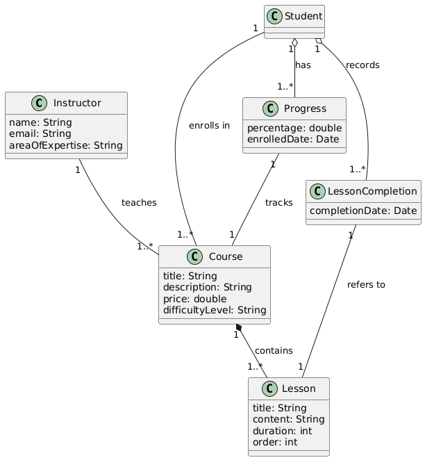

### Structural Consistency: **INCONSISTENT**

* Run 2: Progress attributes differ (added: ['enrollmentDate'], removed: ['enrolledDate'])

---

## TC05: Hotel: Hotel Booking (Class Diagram)

### Run 1

```plantuml
@startuml

class Hotel

class Room {
  number: int
  type: String
  floor: int
  nightlyRate: double
}

class Guest {
  id: int
  name: String
  phoneNumber: String
  email: String
}

class Reservation {
  checkInDate: Date
  checkOutDate: Date
  totalCost: double
}

class Payment {
  amount: double
  date: Date
  paymentMethod: String
}

class Amenity {
  name: String
}

Hotel "1" o-- "1..*" Room : has
Room "1" o-- "1..*" Amenity : has
Guest "1" -- "1..*" Reservation : makes
Reservation "1" -- "1" Room : links to
Reservation "1" o-- "0..*" Payment : has

@enduml
```

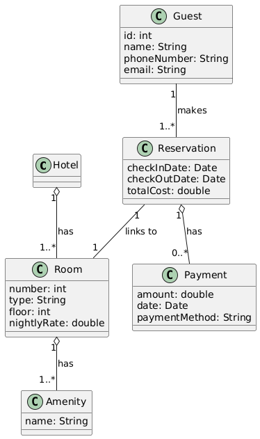

### Run 2

```plantuml
@startuml

class Hotel {
}

class Room {
  number: int
  type: String
  floor: int
  nightlyRate: double
}

class Guest {
  id: int
  name: String
  phoneNumber: String
  email: String
}

class Reservation {
  checkInDate: Date
  checkOutDate: Date
  totalCost: double
}

class Payment {
  amount: double
  date: Date
  paymentMethod: String
}

class Amenity {
  name: String
}

Hotel "1" *-- "1..*" Room : contains
Room "1" o-- "1..*" Amenity : has
Guest "1" -- "1..*" Reservation : makes
Reservation "1" -- "1" Room : links to
Reservation "1" o-- "0..*" Payment : has

@enduml
```

### Run 3

```plantuml
@startuml

class Hotel {
}

class Room {
  number: int
  type: String
  floor: int
  nightlyRate: double
}

class Guest {
  id: int
  name: String
  phoneNumber: String
  email: String
}

class Reservation {
  checkInDate: Date
  checkOutDate: Date
  totalCost: double
}

class Payment {
  amount: double
  date: Date
  paymentMethod: String
}

class Amenity {
  name: String
}

Hotel "1" *-- "1..*" Room : has
Room "1" o-- "1..*" Amenity : has
Guest "1" -- "1..*" Reservation : makes
Reservation "1" -- "1" Room : links to
Reservation "1" o-- "0..*" Payment : has

@enduml
```

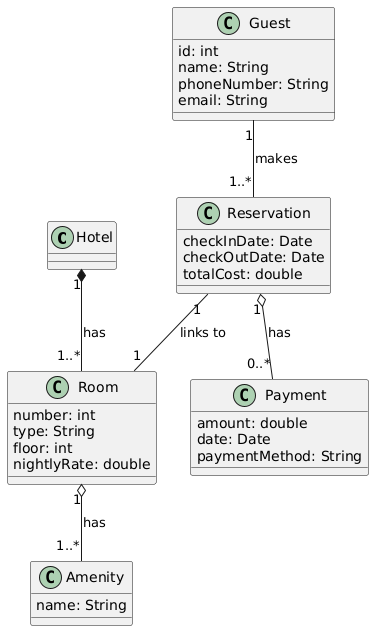

### Run 4

```plantuml
@startuml

class Hotel

class Room {
  number: int
  type: String
  floor: int
  nightlyRate: double
}

class Guest {
  id: int
  name: String
  phoneNumber: String
  email: String
}

class Reservation {
  checkInDate: Date
  checkOutDate: Date
  totalCost: double
}

class Payment {
  amount: double
  date: Date
  paymentMethod: String
}

class Amenity {
  name: String
}

Hotel "1" *-- "1..*" Room : contains
Room "1" o-- "1..*" Amenity : has
Guest "1" -- "1..*" Reservation : makes
Reservation "1" -- "1" Room : links to
Reservation "1" o-- "0..*" Payment : has

@enduml
```

### Run 5

```plantuml
@startuml

class Hotel {
}

class Room {
  number: int
  type: String
  floor: int
  nightlyRate: double
}

class Guest {
  id: int
  name: String
  phoneNumber: String
  email: String
}

class Reservation {
  checkInDate: Date
  checkOutDate: Date
  totalCost: double
}

class Payment {
  amount: double
  date: Date
  paymentMethod: String
}

class Amenity {
  name: String
}

Hotel "1" *-- "1..*" Room : has
Room "1" o-- "1..*" Amenity : has
Guest "1" -- "1..*" Reservation : makes
Reservation "1" -- "1" Room : links to
Reservation "1" o-- "0..*" Payment : has

@enduml
```

### Structural Consistency: **CONSISTENT**

All 5 runs produce structurally identical output (same classes, attributes, and relationships).

---

## TC06: Restaurant: Restaurant Ordering (Class Diagram)

### Run 1

```plantuml
@startuml

class Menu

class MenuItem {
  name: String
  description: String
  price: double
  category: String
}

class Category {
  name: String
}

class Order {
  orderNumber: int
  placedAt: Date
  status: String
  total: double
}

class OrderItem {
  quantity: int
  specialRequests: String
}

class Customer

class Waiter

class Table {
  number: int
  capacity: int
}

Menu "1" *-- "1..*" MenuItem : contains
MenuItem "1" -- "1" Category : belongs to
Order "1" *-- "1..*" OrderItem : contains
OrderItem "1" -- "1" MenuItem : references
Customer "1" -- "1..*" Order : places
Waiter "1" -- "1..*" Table : takes care of
Table "1" -- "1..*" Order : associated with

@enduml
```

### Run 2

```plantuml
@startuml

class Menu

class MenuItem {
  name: String
  description: String
  price: double
  category: String
}

class Category {
  name: String
}

class Order {
  orderNumber: int
  placedAt: Date
  status: String
  total: double
}

class OrderItem {
  quantity: int
  specialRequests: String
}

class Customer

class Waiter

class Table {
  number: int
  capacity: int
}

Menu "1" *-- "1..*" MenuItem : contains
MenuItem "1" -- "1" Category : belongs to
Order "1" *-- "1..*" OrderItem : contains
OrderItem "1" -- "1" MenuItem : references
Customer "1" -- "1..*" Order : places
Waiter "1" -- "1..*" Table : takes care of
Table "1" -- "1..*" Order : associated with

@enduml
```

### Run 3

```plantuml
@startuml

class Menu

class MenuItem {
  name: String
  description: String
  price: double
  category: String
}

class Category {
  name: String
}

class Order {
  orderNumber: int
  placedAt: Date
  status: String
  total: double
}

class OrderItem {
  quantity: int
  specialRequests: String
}

class Customer

class Waiter

class Table {
  number: int
  capacity: int
}

Menu "1" *-- "1..*" MenuItem : contains
MenuItem "1" -- "1" Category : belongs to
Order "1" *-- "1..*" OrderItem : contains
OrderItem "1" -- "1" MenuItem : references
Customer "1" -- "1..*" Order : places
Waiter "1" -- "*" Table : takes care of
Table "1" -- "1..*" Order : associated with

@enduml
```

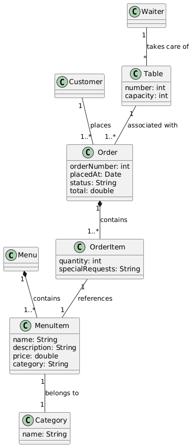

### Run 4

```plantuml
@startuml

class Menu

class MenuItem {
  name: String
  description: String
  price: double
  category: String
}

class Category {
  name: String
}

class Order {
  orderNumber: int
  placedAt: Date
  status: String
  total: double
}

class OrderItem {
  quantity: int
  specialRequests: String
}

class Customer

class Waiter

class Table {
  number: int
  capacity: int
}

Menu "1" *-- "1..*" MenuItem : contains
MenuItem "1" -- "1" Category : belongs to
Order "1" *-- "1..*" OrderItem : contains
OrderItem "1" -- "1" MenuItem : references
Customer "1" -- "1..*" Order : places
Waiter "1" -- "1..*" Table : takes care of
Table "1" -- "1..*" Order : associated with

@enduml
```

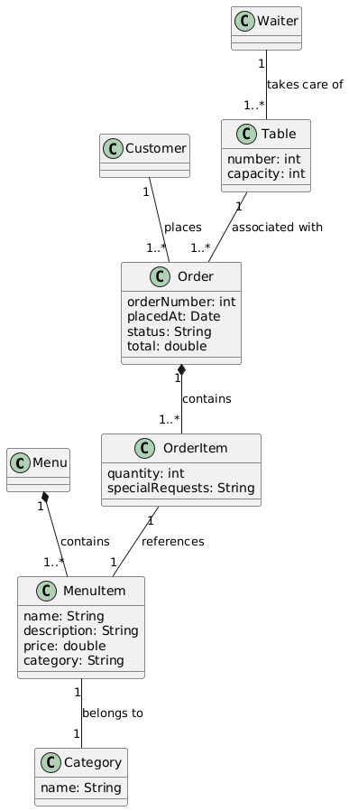

### Run 5

```plantuml
@startuml

class Menu {
}

class MenuItem {
  name: String
  description: String
  price: double
  category: String
}

class Category {
  name: String
}

class Order {
  orderNumber: int
  placedAt: Date
  status: String
  total: double
}

class OrderItem {
  quantity: int
  specialRequests: String
}

class Customer {
}

class Waiter {
}

class Table {
  number: int
  capacity: int
}

Menu "1" *-- "*" MenuItem : contains
MenuItem "1" -- "1" Category : belongs to
Order "1" *-- "1..*" OrderItem : contains
OrderItem "1" -- "1" MenuItem : references
Customer "1" -- "*" Order : places
Waiter "1" -- "*" Table : takes care of
Table "1" -- "*" Order : associated with

@enduml
```

### Structural Consistency: **CONSISTENT**

All 5 runs produce structurally identical output (same classes, attributes, and relationships).

---

## TC07: ProjectTasks: Project Task Tracking (Class Diagram)

### Run 1

```plantuml
@startuml

class Project {
  name: String
  description: String
  startDate: Date
  deadline: Date
}

class Task {
  title: String
  description: String
  status: String
  priorityLevel: String
  dueDate: Date
}

class TeamMember {
  name: String
  role: String
}

class TimeEntry {
  hoursWorked: double
  description: String
}

Project "1" *-- "1..*" Task : has
Task "1..1" -- "1..*" TeamMember : assigned to
TeamMember "1..*" o-- "1..*" TimeEntry : logs
Task "1..*" o-- "1..*" TimeEntry : has
Project "1" -- "1" TeamMember : lead by

@enduml
```

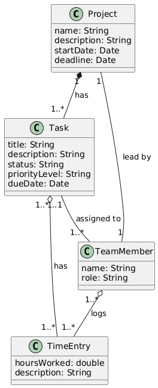

### Run 2

```plantuml
@startuml

class Project {
  name: String
  description: String
  startDate: Date
  deadline: Date
}

class Task {
  title: String
  description: String
  status: String
  priorityLevel: String
  dueDate: Date
}

class TeamMember {
  name: String
  role: String
}

class TimeEntry {
  hoursWorked: double
  description: String
}

Project "1" *-- "1..*" Task : contains
Task "1..*" -- "1..*" TeamMember : assigned to
TeamMember "1..*" o-- "1..*" TimeEntry : logs
Task "1..*" -- "1..*" TimeEntry : has
Project "1" -- "1" TeamMember : has lead

@enduml
```

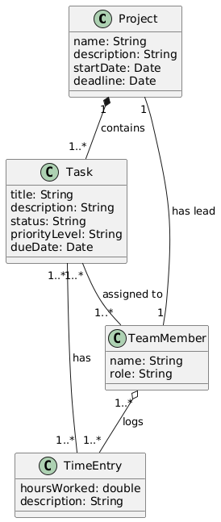

### Run 3

```plantuml
@startuml

class Project {
  name: String
  description: String
  startDate: Date
  deadline: Date
}

class Task {
  title: String
  description: String
  status: String
  priorityLevel: String
  dueDate: Date
}

class TeamMember {
  name: String
  role: String
}

class TimeEntry {
  hoursWorked: double
  description: String
}

Project "1" *-- "1..*" Task : contains
Task "1" -- "1..*" TeamMember : assigned to
TeamMember "1" o-- "1..*" TimeEntry : logs
Task "1" o-- "1..*" TimeEntry : has
Project "1" -- "1" TeamMember : has lead

@enduml
```

### Run 4

```plantuml
@startuml

class Project {
  name: String
  description: String
  startDate: Date
  deadline: Date
}

class Task {
  title: String
  description: String
  status: String
  priorityLevel: String
  dueDate: Date
}

class TeamMember {
  name: String
  role: String
}

class TimeEntry {
  hoursWorked: double
  description: String
}

Project "1" *-- "1..*" Task : contains
Task "1" o-- "1..*" TimeEntry : has
Task "1" -- "1..*" TeamMember : assigned to
TeamMember "1" o-- "1..*" TimeEntry : logs
Project "1" -- "1" TeamMember : has lead

@enduml
```

### Run 5

```plantuml
@startuml

class Project {
  name: String
  description: String
  startDate: Date
  deadline: Date
}

class Task {
  title: String
  description: String
  status: String
  priorityLevel: String
  dueDate: Date
}

class TeamMember {
  name: String
  role: String
}

class TimeEntry {
  hoursWorked: double
  description: String
}

Project "1" *-- "1..*" Task : contains
Task "1" -- "1..*" TeamMember : assigned to
TeamMember "1" o-- "1..*" TimeEntry : logs
Task "1" o-- "1..*" TimeEntry : has
Project "1" -- "1" TeamMember : has lead

@enduml
```

### Structural Consistency: **CONSISTENT**

All 5 runs produce structurally identical output (same classes, attributes, and relationships).

---

## TC08: OnlineStore: Online Store (Class Diagram)

### Run 1

```plantuml
@startuml

class Customer {
  id: int
  firstName: String
  lastName: String
  email: String
  phone: String
  password: String
  registeredDate: Date
}

class ShoppingCart {
}

class Wishlist {
}

class ShippingAddress {
  street: String
  city: String
  zip: String
  country: String
}

class CartItem {
  quantity: int
  addedDate: Date
}

class Product {
  id: int
  name: String
  description: String
  price: double
  stock: int
  isActive: boolean
}

class Category {
  id: int
  name: String
  description: String
}

class Image {
  url: String
  isMain: boolean
}

class Review {
  id: int
  rating: int
  comment: String
  date: Date
}

class Order {
  id: int
  date: Date
  status: String
  total: double
}

class OrderItem {
  quantity: int
  priceAtPurchase: double
}

class Payment {
  id: int
  amount: double
  method: String
  date: Date
}

Customer "1" *-- "1" ShoppingCart : has
Customer "1" *-- "1" Wishlist : has
Customer "1" o-- "*" ShippingAddress : saves
ShoppingCart "1" *-- "*" CartItem : contains
CartItem "1" --> "1" Product : points to
Product "1" --> "1" Category : belongs to
Product "1" o-- "*" Image : has
Customer "1" --> "*" Review : writes
Review "1" --> "1" Product : for
Category "0..1" --> "*" Category : has child
Customer "1" --> "*" Order : places
Order "1" *-- "*" OrderItem : contains
OrderItem "1" --> "1" Product : refers to
Order "1" --> "1" ShippingAddress : shipped to
Order "1" *-- "1" Payment : has

@enduml
```

### Run 2

```plantuml
@startuml

class Customer {
  id: int
  firstName: String
  lastName: String
  email: String
  phone: String
}

class ShoppingCart

class Wishlist

class ShippingAddress {
  street: String
  city: String
  zip: String
  country: String
}

class CartItem {
  quantity: int
  addedDate: Date
}

class Product {
  id: int
  name: String
  description: String
  price: double
  stock: int
}

class Category {
  id: int
  name: String
  description: String
}

class Image {
  url: String
  isMain: boolean
}

class Review {
  id: int
  rating: int
  comment: String
  date: Date
}

class Order {
  id: int
  date: Date
  status: String
  total: double
}

class OrderLineItem {
  quantity: int
  priceAtPurchase: double
}

class Payment {
  id: int
  amount: double
  method: String
  date: Date
}

Customer "1" *-- "1" ShoppingCart : has
Customer "1" *-- "1" Wishlist : has
Customer "1" o-- "*" ShippingAddress : saves
ShoppingCart "1" *-- "*" CartItem : contains
CartItem "1" -- "1" Product : references
Product "1" -- "1" Category : belongs to
Product "1" o-- "*" Image : has
Customer "1" -- "*" Review : writes
Review "1" -- "1" Product : for
Category "0..1" -- "*" Category : has parent
Customer "1" -- "*" Order : places
Order "1" *-- "1..*" OrderLineItem : contains
OrderLineItem "1" -- "1" Product : references
Order "1" -- "1" ShippingAddress : shipped to
Order "1" *-- "1" Payment : has

@enduml
```

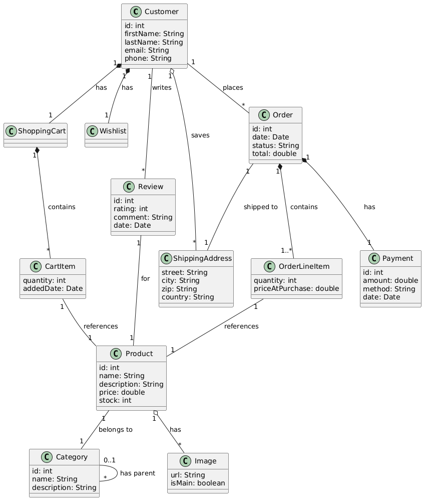

### Run 3

```plantuml
@startuml

class Customer {
  id: int
  firstName: String
  lastName: String
  email: String
  phone: String
  password: String
  registeredDate: Date
}

class ShoppingCart {
}

class Wishlist {
}

class ShippingAddress {
  street: String
  city: String
  zip: String
  country: String
}

class CartItem {
  quantity: int
  addedDate: Date
}

class Product {
  id: int
  name: String
  description: String
  price: double
  stock: int
  isActive: boolean
}

class Category {
  id: int
  name: String
  description: String
}

class Image {
  url: String
  isMain: boolean
}

class Review {
  id: int
  rating: int
  comment: String
  date: Date
}

class Order {
  id: int
  date: Date
  status: String
  total: double
}

class OrderLineItem {
  quantity: int
  priceAtPurchase: double
}

class Payment {
  id: int
  amount: double
  method: String
  date: Date
}

Customer "1" *-- "1" ShoppingCart : has
Customer "1" *-- "1" Wishlist : has
Customer "1" o-- "*" ShippingAddress : saves
ShoppingCart "1" *-- "*" CartItem : contains
CartItem "1" --> "1" Product : points to
Product "1" --> "1" Category : belongs to
Product "1" o-- "*" Image : has
Customer "1" --> "*" Review : writes
Review "1" --> "1" Product : for
Category "0..1" --> "*" Category : has parent
Customer "1" --> "*" Order : places
Order "1" *-- "*" OrderLineItem : has
OrderLineItem "1" --> "1" Product : references
Order "1" --> "1" ShippingAddress : shipped to
Order "1" *-- "1" Payment : has

@enduml
```

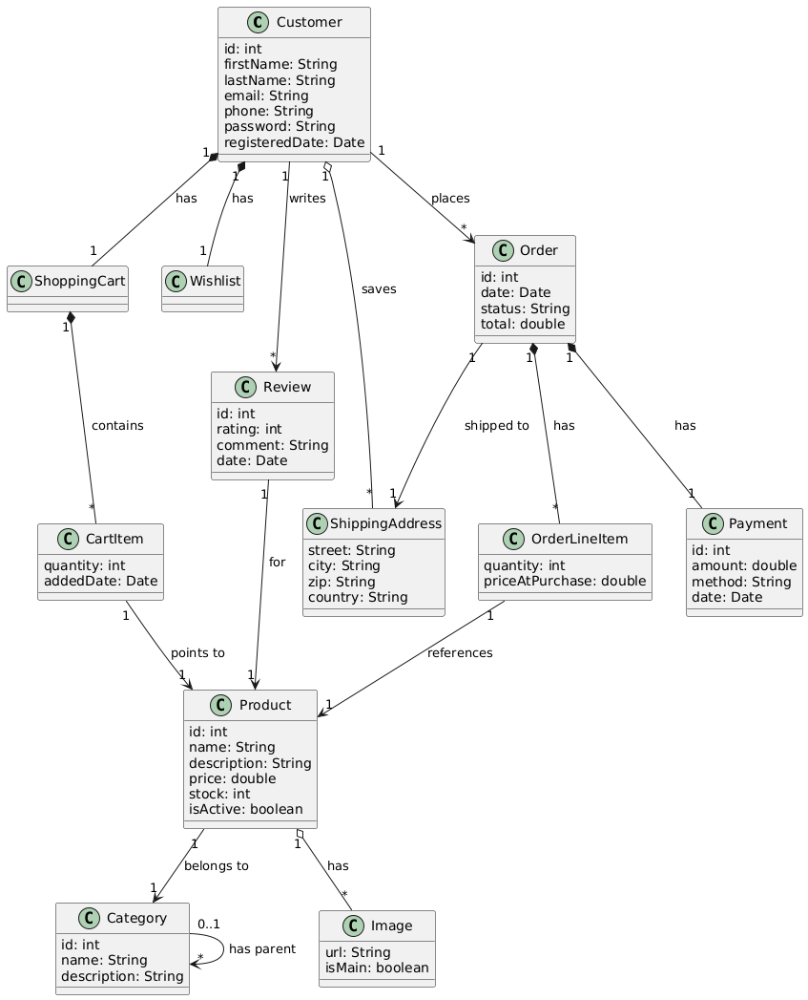

### Run 4

```plantuml
@startuml

class Customer {
  id: int
  firstName: String
  lastName: String
  email: String
  phone: String
  password: String
  registeredDate: Date
}

class ShoppingCart

class Wishlist

class ShippingAddress {
  street: String
  city: String
  zip: String
  country: String
}

class CartItem {
  quantity: int
  addedDate: Date
}

class Product {
  id: int
  name: String
  description: String
  price: double
  stock: int
  isActive: boolean
}

class Category {
  id: int
  name: String
  description: String
}

class Image {
  url: String
  isMain: boolean
}

class Review {
  id: int
  rating: int
  comment: String
  date: Date
}

class Order {
  id: int
  date: Date
  status: String
  total: double
}

class OrderLineItem {
  quantity: int
  priceAtPurchase: double
}

class Payment {
  id: int
  amount: double
  method: String
  date: Date
}

Customer "1" *-- "1" ShoppingCart : has
Customer "1" *-- "1" Wishlist : has
Customer "1" o-- "*" ShippingAddress : saves
ShoppingCart "1" *-- "*" CartItem : contains
CartItem "1" --> "1" Product : points to
Product "1" --> "1" Category : belongs to
Product "1" o-- "*" Image : has
Customer "1" --> "*" Review : writes
Review "1" --> "1" Product : for
Category "0..1" -- "0..*" Category : has child
Customer "1" --> "*" Order : places
Order "1" *-- "*" OrderLineItem : has
OrderLineItem "1" --> "1" Product : references
Order "1" --> "1" ShippingAddress : shipped to
Order "1" *-- "1" Payment : has

@enduml
```

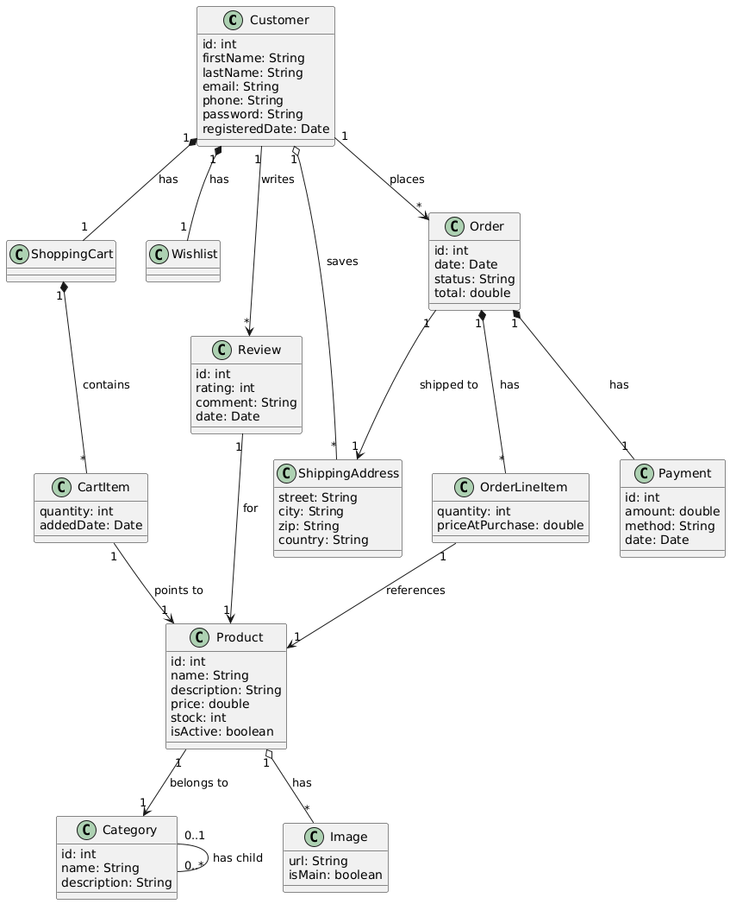

### Run 5

```plantuml
@startuml

class Customer {
  id: int
  firstName: String
  lastName: String
  email: String
  phone: String
}

class ShoppingCart
class Wishlist
class ShippingAddress {
  street: String
  city: String
  zip: String
  country: String
}

class CartItem {
  quantity: int
  addedDate: Date
}

class Product {
  id: int
  name: String
  description: String
  price: double
  stock: int
}

class Category {
  id: int
  name: String
  description: String
}

class Image {
  url: String
  isMain: boolean
}

class Review {
  id: int
  rating: int
  comment: String
  date: Date
}

class Order {
  id: int
  date: Date
  status: String
  total: double
}

class OrderLineItem {
  quantity: int
  priceAtPurchase: double
}

class Payment {
  id: int
  amount: double
  method: String
  date: Date
}

Customer "1" *-- "1" ShoppingCart : has
Customer "1" *-- "1" Wishlist : has
Customer "1" o-- "*" ShippingAddress : saves
ShoppingCart "1" *-- "*" CartItem : contains
CartItem "1" --> "1" Product : points to
Product "1" --> "1" Category : belongs to
Product "1" o-- "*" Image : has
Customer "1" -- "*" Review : writes
Review "1" --> "1" Product : for
Category "0..1" -- "*" Category : has parent
Customer "1" -- "*" Order : places
Order "1" *-- "*" OrderLineItem : has
OrderLineItem "1" --> "1" Product : references
Order "1" --> "1" ShippingAddress : shipped to
Order "1" *-- "1" Payment : has

@enduml
```

### Structural Consistency: **INCONSISTENT**

* Run 2: different class set (['OrderLineItem'] added, ['OrderItem'] removed)
* Run 2: Customer attributes differ (removed: ['password', 'registeredDate'])
* Run 2: OrderItem attributes differ (removed: ['priceAtPurchase', 'quantity'])
* Run 2: Product attributes differ (removed: ['isActive'])
* Run 2: OrderLineItem attributes differ (added: ['priceAtPurchase', 'quantity'])

---

## TC09: Hospital: Hospital Management (Class Diagram)

### Run 1

```plantuml
@startuml

class Patient {
  id: int
  firstName: String
  lastName: String
  birthday: Date
  gender: String
  bloodType: String
  phone: String
  address: String
}

class Doctor {
  id: int
  name: String
  specialization: String
  phone: String
  email: String
}

class Department {
  name: String
  floor: int
}

class Appointment {
  id: int
  dateTime: DateTime
  reasonForVisit: String
  status: String
}

class MedicalRecord {
  id: int
  diagnosis: String
  symptoms: String
  notes: String
  date: Date
}

class Prescription {
  id: int
  dosageInstructions: String
  startDate: Date
  endDate: Date
}

class Medication {
  id: int
  name: String
  manufacturer: String
  price: double
}

class Room {
  number: int
  type: String
  dailyRate: double
}

class Admission {
  admittedDate: Date
  dischargedDate: Date
  totalCost: double
}

class Invoice {
  number: int
  issuedDate: Date
  dueDate: Date
  total: double
  isPaid: boolean
}

class LineItem {
  service: String
  cost: double
}

Doctor "1" -- "1" Department : assigned to
Patient "1" -- "1..*" Appointment : has
Doctor "1" -- "1..*" Appointment : conducts
Appointment "1" *-- "1..*" MedicalRecord : creates
Doctor "1" -- "1..*" MedicalRecord : writes
Doctor "1" -- "1..*" Prescription : writes
Prescription "1" -- "1" Medication : is for
Patient "0..1" -- "1" Room : admitted to
Room "1" *-- "1" Admission : tracks
Patient "1" -- "1..*" Invoice : billed through
Invoice "1" *-- "1..*" LineItem : contains

@enduml
```

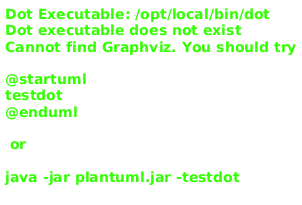

### Run 2

```plantuml
@startuml

class Patient {
  id: int
  firstName: String
  lastName: String
  birthday: Date
  gender: String
  bloodType: String
  phone: String
  address: String
}

class Doctor {
  id: int
  name: String
  specialization: String
  phone: String
  email: String
}

class Department {
  name: String
  floor: int
}

class Appointment {
  id: int
  dateTime: DateTime
  reasonForVisit: String
  status: String
}

class MedicalRecord {
  id: int
  diagnosis: String
  symptoms: String
  notes: String
  date: Date
}

class Prescription {
  id: int
  dosageInstructions: String
  startDate: Date
  endDate: Date
}

class Medication {
  id: int
  name: String
  manufacturer: String
  price: double
}

class Room {
  number: int
  type: String
  dailyRate: double
}

class Admission {
  admittedDate: Date
  dischargedDate: Date
  totalCost: double
}

class Invoice {
  number: int
  issuedDate: Date
  dueDate: Date
  total: double
  isPaid: boolean
}

class LineItem {
  service: String
  cost: double
}

Doctor "1" -- "1" Department : assigned to
Patient "1" -- "1..*" Appointment : has
Doctor "1" -- "1..*" Appointment : conducts
Appointment "1" *-- "1" MedicalRecord : creates
Doctor "1" -- "1..*" MedicalRecord : writes
Doctor "1" -- "1..*" Prescription : writes
Prescription "1" -- "1" Medication : for
Patient "0..1" -- "1" Room : admitted to
Room "1" *-- "1" Admission : tracks
Patient "1" -- "1..*" Invoice : billed through
Invoice "1" *-- "1..*" LineItem : contains

@enduml
```

### Run 3

```plantuml
@startuml

class Patient {
  id: int
  firstName: String
  lastName: String
  birthday: Date
  gender: String
  bloodType: String
  phone: String
  address: String
}

class Doctor {
  id: int
  name: String
  specialization: String
  phone: String
  email: String
}

class Department {
  name: String
  floor: int
}

class Appointment {
  id: int
  dateTime: Date
  reasonForVisit: String
  status: String
}

class MedicalRecord {
  id: int
  diagnosis: String
  symptoms: String
  notes: String
  date: Date
}

class Prescription {
  id: int
  dosageInstructions: String
  startDate: Date
  endDate: Date
}

class Medication {
  id: int
  name: String
  manufacturer: String
  price: double
}

class Room {
  number: int
  type: String
  dailyRate: double
}

class Admission {
  admittedDate: Date
  dischargedDate: Date
  totalCost: double
}

class Invoice {
  number: int
  issuedDate: Date
  dueDate: Date
  total: double
  isPaid: boolean
}

class LineItem {
  service: String
  cost: double
}

Doctor "1" -- "1" Department : assigned to
Patient "1" -- "1..*" Appointment : has
Doctor "1" -- "1..*" Appointment : conducts
Appointment "1" *-- "1" MedicalRecord : creates
Doctor "1" -- "1..*" MedicalRecord : writes
Doctor "1" -- "1..*" Prescription : writes
Prescription "1" -- "1" Medication : for
Patient "0..1" -- "1" Room : admitted to
Room "1" *-- "1" Admission : tracks
Patient "1" -- "1..*" Invoice : billed through
Invoice "1" *-- "1..*" LineItem : contains

@enduml
```

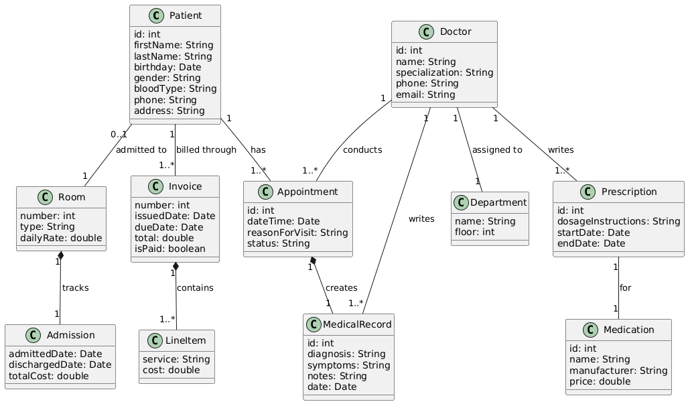

### Run 4

```plantuml
@startuml

class Patient {
  id: int
  firstName: String
  lastName: String
  birthday: Date
  gender: String
  bloodType: String
  phone: String
  address: String
}

class Doctor {
  id: int
  name: String
  specialization: String
  phone: String
  email: String
}

class Department {
  name: String
  floor: int
}

class Appointment {
  id: int
  dateTime: DateTime
  reasonForVisit: String
  status: String
}

class MedicalRecord {
  id: int
  diagnosis: String
  symptoms: String
  notes: String
  date: Date
}

class Prescription {
  id: int
  dosageInstructions: String
  startDate: Date
  endDate: Date
}

class Medication {
  id: int
  name: String
  manufacturer: String
  price: double
}

class Room {
  number: int
  type: String
  dailyRate: double
}

class Admission {
  admittedDate: Date
  dischargedDate: Date
  totalCost: double
}

class Invoice {
  number: int
  issuedDate: Date
  dueDate: Date
  total: double
  isPaid: boolean
}

class LineItem {
  service: String
  cost: double
}

Doctor "1" -- "1" Department : assigned to
Patient "1" -- "1..*" Appointment : has
Doctor "1" -- "1..*" Appointment : conducts
Appointment "1" *-- "1" MedicalRecord : creates
Doctor "1" -- "1..*" MedicalRecord : writes
Doctor "1" -- "1..*" Prescription : writes
Prescription "1" -- "1" Medication : for
Patient "0..1" -- "1" Room : admitted to
Room "1" *-- "1" Admission : tracks
Patient "1" -- "1..*" Invoice : billed through
Invoice "1" *-- "1..*" LineItem : contains

@enduml
```

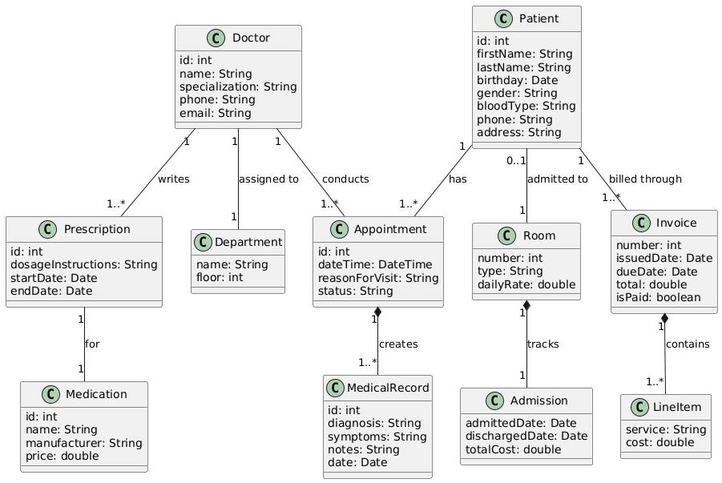

### Run 5

```plantuml
@startuml

class Patient {
  id: int
  firstName: String
  lastName: String
  birthday: Date
  gender: String
  bloodType: String
  phone: String
  address: String
}

class Doctor {
  id: int
  name: String
  specialization: String
  phone: String
  email: String
}

class Department {
  name: String
  floor: int
}

class Appointment {
  id: int
  dateTime: DateTime
  reasonForVisit: String
  status: String
}

class MedicalRecord {
  id: int
  diagnosis: String
  symptoms: String
  notes: String
  date: Date
}

class Prescription {
  id: int
  dosageInstructions: String
  startDate: Date
  endDate: Date
}

class Medication {
  id: int
  name: String
  manufacturer: String
  price: double
}

class Room {
  number: int
  type: String
  dailyRate: double
}

class Admission {
  admittedDate: Date
  dischargedDate: Date
  totalCost: double
}

class Invoice {
  number: int
  issuedDate: Date
  dueDate: Date
  total: double
  isPaid: boolean
}

class LineItem {
  service: String
  cost: double
}

Doctor "1" -- "1" Department : assigned to
Patient "1" -- "1..*" Appointment : has
Doctor "1" -- "1..*" Appointment : conducts
Appointment "1" *-- "1" MedicalRecord : creates
Doctor "1" -- "1..*" MedicalRecord : writes
Doctor "1" -- "1..*" Prescription : writes
Prescription "1" -- "1" Medication : for
Patient "0..1" -- "1" Room : admitted to
Room "1" *-- "1" Admission : tracks
Patient "1" -- "1..*" Invoice : billed through
Invoice "1" *-- "1..*" LineItem : contains

@enduml
```

### Structural Consistency: **CONSISTENT**

All 5 runs produce the same 11 classes (including Admission) with consistent attributes and relationships.

---

## TC10: University: University Registration (Class Diagram)

### Run 1

```plantuml
@startuml

class Student {
  id: int
  firstName: String
  lastName: String
  email: String
  enrolledDate: Date
  gpa: float
}

class Major {
  name: String
  requiredCredits: int
}

class Course {
  code: String
  title: String
  description: String
  creditHours: int
}

class Department {
  name: String
  building: String
}

class Faculty {
  id: int
  name: String
  title: String
  officeLocation: String
}

class Section {
  number: int
  semester: String
  year: int
  meetingTime: String
  room: String
}

class Room {
  number: String
  building: String
  seatCount: int
}

class Grade {
  value: String
}

class Club {
  name: String
  description: String
}

Student "1" -- "1" Major : picks
Course "1" -- "1" Department : offered by
Faculty "1" -- "1..*" Section : teaches
Student "1" -- "1..*" Section : enrolls in
Section "1" -- "1" Room : meets in
Student "1" -- "1" Grade : receives
Section "1" -- "1..*" Grade : assigns
Student "1" -- "*" Club : joins
Club "1" -- "1" Student : has president
Course "1" -- "0..*" Course : has prerequisite
Course "1" -- "*" Major : required for

@enduml
```

### Run 2

```plantuml
@startuml

class Student {
  id: int
  firstName: String
  lastName: String
  email: String
  enrolledDate: Date
  gpa: float
}

class Major {
  name: String
  requiredCredits: int
}

class Course {
  code: String
  title: String
  description: String
  creditHours: int
}

class Department {
  name: String
  building: String
}

class Faculty {
  id: int
  name: String
  title: String
  officeLocation: String
}

class Section {
  number: int
  semester: String
  year: int
  meetingTime: String
  room: String
}

class Room {
  number: String
  building: String
  seatCount: int
}

class Grade {
  value: String
}

class Club {
  name: String
  description: String
}

Student "1" -- "1" Major : picks
Course "1" -- "1" Department : offered by
Faculty "1" -- "1..*" Section : teaches
Student "1" -- "1..*" Section : enrolls in
Section "1" -- "1" Room : meets in
Student "1" -- "1..*" Grade : receives
Section "1" -- "1..*" Grade : assigns
Student "1" -- "1..*" Club : joins
Club "1" -- "1" Student : has president
Course "1" -- "0..*" Course : has prerequisite
Course "0..*" -- "1" Major : required for

@enduml
```

### Run 3

```plantuml
@startuml

class Student {
  id: int
  firstName: String
  lastName: String
  email: String
  enrolledDate: Date
  gpa: float
}

class Major {
  name: String
  requiredCredits: int
}

class Course {
  code: String
  title: String
  description: String
  creditHours: int
}

class Department {
  name: String
  building: String
}

class Faculty {
  id: int
  name: String
  title: String
  officeLocation: String
}

class Section {
  number: int
  semester: String
  year: int
  meetingTime: String
  room: String
}

class Room {
  number: String
  building: String
  seatCount: int
}

class Grade {
  value: String
}

class Club {
  name: String
  description: String
}

Student "1" -- "1" Major : picks
Course "1" -- "1" Department : offered by
Faculty "1" -- "1..*" Section : teaches
Student "1" -- "1..*" Section : enrolls in
Section "1" -- "1" Room : meets in
Student "1" -- "1" Grade : receives
Section "1" -- "1" Grade : assigns
Student "0..1" -- "0..*" Club : joins
Club "1" -- "1" Student : has president
Course "1" -- "0..*" Course : has prerequisite
Course "0..*" -- "1" Major : required for

@enduml
```

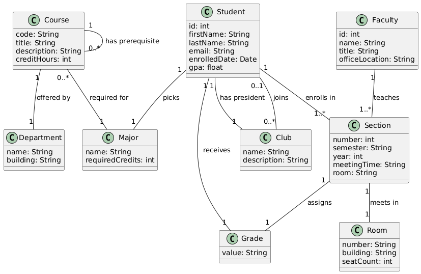

### Run 4

```plantuml
@startuml

class Student {
  id: int
  firstName: String
  lastName: String
  email: String
  enrolledDate: Date
  gpa: float
}

class Major {
  name: String
  requiredCredits: int
}

class Course {
  code: String
  title: String
  description: String
  creditHours: int
}

class Department {
  name: String
  building: String
}

class Faculty {
  id: int
  name: String
  title: String
  officeLocation: String
}

class Section {
  number: int
  semester: String
  year: int
  meetingTime: String
  room: String
}

class Room {
  number: String
  building: String
  seatCount: int
}

class Grade {
  value: String
}

class Club {
  name: String
  description: String
}

Student "1" -- "1" Major : picks
Course "1" -- "1" Department : offered by
Faculty "1" -- "*" Section : teaches
Student "1" -- "*" Section : enrolls in
Section "1" -- "1" Room : meets in
Student "1" -- "*" Grade : receives
Section "1" -- "*" Grade : assigns
Student "0..1" -- "*" Club : joins
Club "1" -- "1" Student : has president
Course "0..1" -- "*" Course : has prerequisite
Course "0..1" -- "*" Major : required for

@enduml
```

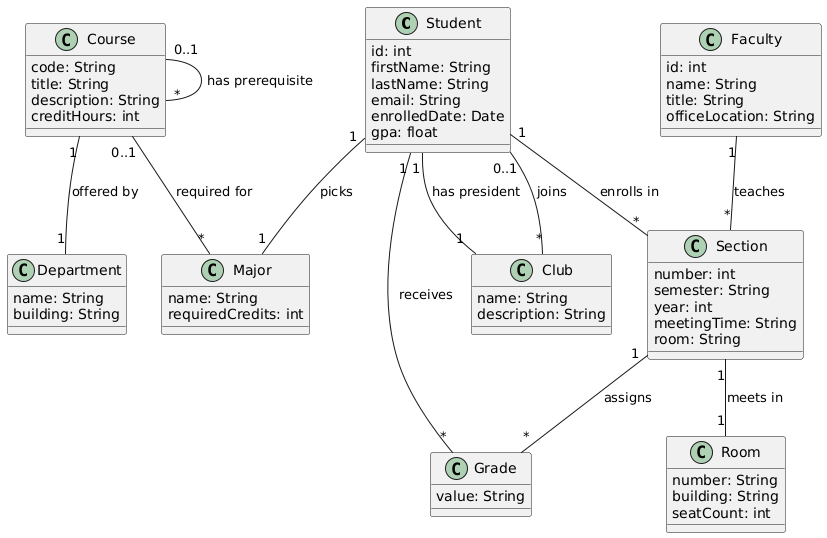

### Run 5

```plantuml
@startuml

class Student {
  id: int
  firstName: String
  lastName: String
  email: String
  enrolledDate: Date
  gpa: float
}

class Major {
  name: String
  requiredCredits: int
}

class Course {
  code: String
  title: String
  description: String
  creditHours: int
}

class Department {
  name: String
  building: String
}

class Faculty {
  id: int
  name: String
  title: String
  officeLocation: String
}

class Section {
  number: int
  semester: String
  year: int
  meetingTime: String
  room: String
}

class Room {
  number: String
  building: String
  seatCount: int
}

class Grade {
  value: String
}

class Club {
  name: String
  description: String
}

Student "1" -- "1" Major : picks
Course "1" -- "1" Department : offered by
Faculty "1" -- "1..*" Section : teaches
Student "1" -- "1..*" Section : enrolls in
Section "1" -- "1" Room : meets in
Student "1" -- "1" Grade : receives
Section "1" -- "1" Grade : assigns
Student "0..*" -- "1" Club : joins
Club "1" -- "1" Student : has president
Course "0..1" -- "1" Course : has prerequisite
Course "0..*" -- "1" Major : required for

@enduml
```

### Structural Consistency: **CONSISTENT**

All 5 runs produce structurally identical output (same classes, attributes, and relationships).

---

## TC11: ATM: ATM System (Use Case Diagram)

### Run 1

```plantuml
@startuml

left to right direction

actor "Bank Customer" as BC
actor "Admin" as AD
actor "Bank System" as BS <<system>>

rectangle "ATM System" {
  usecase "Enter PIN" as UC1
  usecase "Verify PIN" as UC2
  usecase "Check balance" as UC3
  usecase "Withdraw cash" as UC4
  usecase "Deposit cash" as UC5
  usecase "Transfer money between accounts" as UC6
  usecase "Update balances" as UC7
  usecase "Refill cash" as UC8
  usecase "View transaction history" as UC9
}

BC --> UC1
UC1 ..> UC2 : <<include>>
UC2 --> BS

BC --> UC3
UC3 --> BS

BC --> UC4
UC4 --> BS
UC4 ..> UC7 : <<include>>

BC --> UC5
UC5 --> BS
UC5 ..> UC7 : <<include>>

BC --> UC6
UC6 --> BS
UC6 ..> UC7 : <<include>>

AD --> UC8
AD --> UC9
UC9 --> BS

@enduml
```

### Run 2

```plantuml
@startuml

left to right direction

actor "Bank Customer" as Customer
actor "Admin" as Admin
actor "Bank System" as System <<system>>

rectangle "ATM System" {
  usecase "Enter PIN" as UC_EnterPIN
  usecase "Check balance" as UC_CheckBalance
  usecase "Withdraw cash" as UC_WithdrawCash
  usecase "Deposit cash" as UC_DepositCash
  usecase "Transfer money between accounts" as UC_TransferMoney
  usecase "Refill cash" as UC_RefillCash
  usecase "View transaction history" as UC_ViewHistory
  usecase "Verify PIN" as UC_VerifyPIN
  usecase "Update balances" as UC_UpdateBalances
}

Customer --> UC_EnterPIN
UC_EnterPIN ..> UC_VerifyPIN : <<include>>
UC_VerifyPIN --> System

Customer --> UC_CheckBalance
UC_CheckBalance --> System

Customer --> UC_WithdrawCash
UC_WithdrawCash --> System
UC_WithdrawCash ..> UC_UpdateBalances : <<include>>

Customer --> UC_DepositCash
UC_DepositCash --> System
UC_DepositCash ..> UC_UpdateBalances : <<include>>

Customer --> UC_TransferMoney
UC_TransferMoney --> System
UC_TransferMoney ..> UC_UpdateBalances : <<include>>

Admin --> UC_RefillCash
Admin --> UC_ViewHistory
UC_ViewHistory --> System

@enduml
```

### Run 3

```plantuml
@startuml

left to right direction

actor "Bank Customer" as Customer
actor "Admin" as Admin
actor "Bank System" as System <<system>>

rectangle "ATM System" {
  usecase "Enter PIN" as UC_EnterPIN
  usecase "Check balance" as UC_CheckBalance
  usecase "Withdraw cash" as UC_WithdrawCash
  usecase "Deposit cash" as UC_DepositCash
  usecase "Transfer money between accounts" as UC_TransferMoney
  usecase "Refill cash" as UC_RefillCash
  usecase "View transaction history" as UC_ViewHistory
  usecase "Verify PIN" as UC_VerifyPIN
  usecase "Update balances" as UC_UpdateBalances
}

Customer --> UC_EnterPIN
Customer --> UC_CheckBalance
Customer --> UC_WithdrawCash
Customer --> UC_DepositCash
Customer --> UC_TransferMoney
Admin --> UC_RefillCash
Admin --> UC_ViewHistory

UC_EnterPIN ..> UC_VerifyPIN : <<include>>
UC_CheckBalance ..> UC_EnterPIN : <<include>>
UC_CheckBalance --> System
UC_WithdrawCash ..> UC_EnterPIN : <<include>>
UC_WithdrawCash --> System
UC_WithdrawCash ..> UC_UpdateBalances : <<include>>
UC_DepositCash ..> UC_EnterPIN : <<include>>
UC_DepositCash --> System
UC_DepositCash ..> UC_UpdateBalances : <<include>>
UC_TransferMoney ..> UC_EnterPIN : <<include>>
UC_TransferMoney --> System
UC_TransferMoney ..> UC_UpdateBalances : <<include>>
UC_ViewHistory --> System

@enduml
```

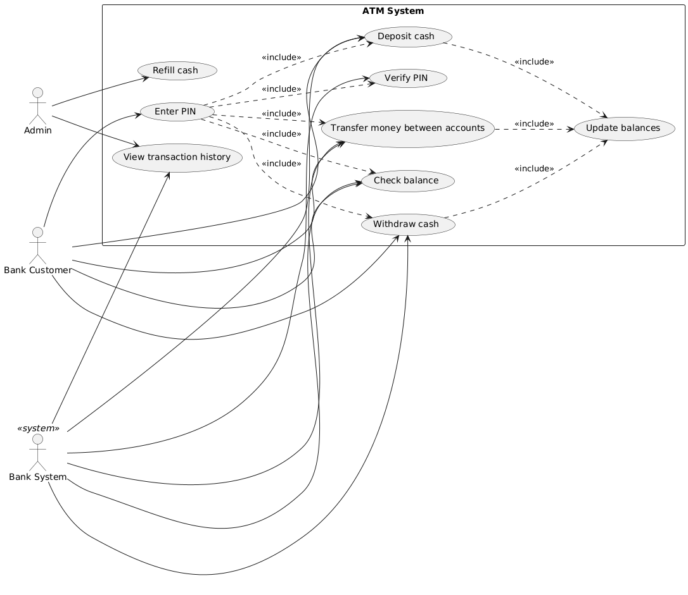

### Run 4

```plantuml
@startuml

left to right direction

actor "Bank Customer" as Customer
actor "Admin" as Admin
actor "Bank System" as System <<system>>

rectangle "ATM System" {
  usecase "Enter PIN" as UC_EnterPIN
  usecase "Check balance" as UC_CheckBalance
  usecase "Withdraw cash" as UC_WithdrawCash
  usecase "Deposit cash" as UC_DepositCash
  usecase "Transfer money between accounts" as UC_TransferMoney
  usecase "Refill cash" as UC_RefillCash
  usecase "View transaction history" as UC_ViewHistory
  usecase "Verify PIN" as UC_VerifyPIN
  usecase "Update balances" as UC_UpdateBalances
}

Customer --> UC_EnterPIN
UC_EnterPIN ..> UC_VerifyPIN : <<include>>
System --> UC_VerifyPIN

Customer --> UC_CheckBalance
UC_EnterPIN ..> UC_CheckBalance : <<include>>
System --> UC_CheckBalance

Customer --> UC_WithdrawCash
UC_EnterPIN ..> UC_WithdrawCash : <<include>>
UC_WithdrawCash ..> UC_UpdateBalances : <<include>>
System --> UC_UpdateBalances

Customer --> UC_DepositCash
UC_EnterPIN ..> UC_DepositCash : <<include>>
UC_DepositCash ..> UC_UpdateBalances : <<include>>

Customer --> UC_TransferMoney
UC_EnterPIN ..> UC_TransferMoney : <<include>>
UC_TransferMoney ..> UC_UpdateBalances : <<include>>

Admin --> UC_RefillCash
Admin --> UC_ViewHistory
System --> UC_ViewHistory

@enduml
```

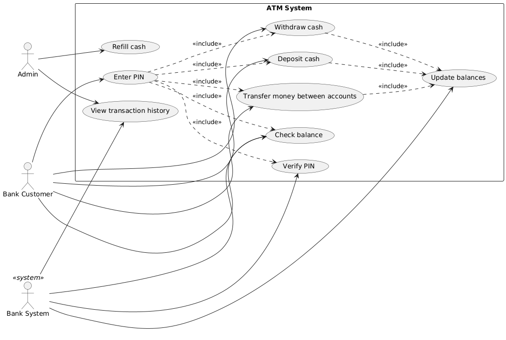

### Run 5

```plantuml
@startuml

left to right direction

actor "Bank Customer" as Customer
actor "Admin" as Admin
actor "Bank System" as System <<system>>

rectangle "ATM System" {
  usecase "Enter PIN" as UC_EnterPIN
  usecase "Verify PIN" as UC_VerifyPIN
  usecase "Check balance" as UC_CheckBalance
  usecase "Withdraw cash" as UC_WithdrawCash
  usecase "Deposit cash" as UC_DepositCash
  usecase "Transfer money between accounts" as UC_TransferMoney
  usecase "Update balances" as UC_UpdateBalances
  usecase "Refill cash" as UC_RefillCash
  usecase "View transaction history" as UC_ViewTransactions
}

Customer --> UC_EnterPIN
UC_EnterPIN ..> UC_VerifyPIN : <<include>>
UC_VerifyPIN --> System

Customer --> UC_CheckBalance
UC_CheckBalance --> System

Customer --> UC_WithdrawCash
UC_WithdrawCash --> System
UC_WithdrawCash ..> UC_UpdateBalances : <<include>>

Customer --> UC_DepositCash
UC_DepositCash --> System
UC_DepositCash ..> UC_UpdateBalances : <<include>>

Customer --> UC_TransferMoney
UC_TransferMoney --> System
UC_TransferMoney ..> UC_UpdateBalances : <<include>>

Admin --> UC_RefillCash
Admin --> UC_ViewTransactions
UC_ViewTransactions --> System

@enduml
```

### Structural Consistency: **CONSISTENT**

All 5 runs produce structurally identical output (same actors, use cases, and relationships).

---

## TC12: OnlineStore: Online Store (Use Case Diagram)

### Run 1

```plantuml
@startuml

left to right direction

actor Customer
actor Admin
actor "Third Party Payment System" <<system>>

rectangle "Online Store System" {
  usecase "Browse products" as UC_Browse
  usecase "Search products by category" as UC_Search
  usecase "Add product to cart" as UC_AddCart
  usecase "Checkout" as UC_Checkout
  usecase "Track order status" as UC_TrackOrder
  usecase "Log in" as UC_Login
  usecase "Process payment" as UC_ProcessPayment
  usecase "Manage stock" as UC_ManageStock
  usecase "Handle refunds" as UC_HandleRefunds
  usecase "Generate sales reports" as UC_GenerateReports
}

Customer --> UC_Browse
Customer --> UC_Search
Customer --> UC_AddCart
Customer --> UC_Checkout
Customer --> UC_TrackOrder
Customer --> UC_Login

UC_Checkout ..> UC_ProcessPayment : <<include>>
"Third Party Payment System" --> UC_ProcessPayment

Admin --> UC_ManageStock
Admin --> UC_HandleRefunds
Admin --> UC_GenerateReports

@enduml
```

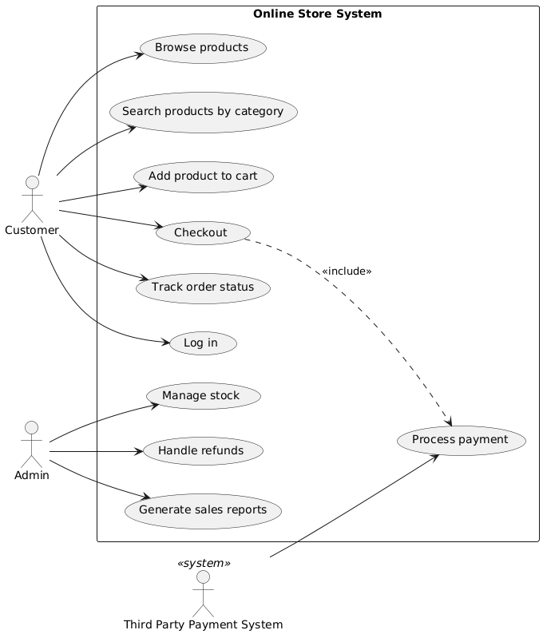

### Run 2

```plantuml
@startuml

left to right direction

actor "Customer" as Customer
actor "Admin" as Admin
actor "Third Party Payment System" as PaymentSystem

rectangle "Online Store System" {
  usecase "Browse products" as UC_Browse
  usecase "Search products by category" as UC_Search
  usecase "Add product to cart" as UC_AddToCart
  usecase "Checkout" as UC_Checkout
  usecase "Track order status" as UC_TrackOrder
  usecase "Log in" as UC_Login
  usecase "Process payment" as UC_Payment
  usecase "Manage stock" as UC_ManageStock
  usecase "Handle refunds" as UC_HandleRefunds
  usecase "Generate sales reports" as UC_SalesReports
}

Customer --> UC_Browse
Customer --> UC_Search
Customer --> UC_AddToCart
Customer --> UC_Checkout
Customer --> UC_TrackOrder
Customer --> UC_Login

UC_Checkout ..> UC_Payment : <<include>>
PaymentSystem --> UC_Payment

Admin --> UC_ManageStock
Admin --> UC_HandleRefunds
Admin --> UC_SalesReports

@enduml
```

### Run 3

```plantuml
@startuml
left to right direction

actor "Customer" as Customer
actor "Admin" as Admin
actor "Third Party Payment System" as PaymentSystem

rectangle "Online Store System" {
  usecase "Browse products" as UC_Browse
  usecase "Search products by category" as UC_Search
  usecase "Add product to cart" as UC_AddToCart
  usecase "Checkout" as UC_Checkout
  usecase "Track order status" as UC_TrackOrder
  usecase "Log in" as UC_Login
  usecase "Process payment" as UC_ProcessPayment
  usecase "Manage stock" as UC_ManageStock
  usecase "Handle refunds" as UC_HandleRefunds
  usecase "Generate sales reports" as UC_GenerateReports
}

Customer --> UC_Browse
Customer --> UC_Search
Customer --> UC_AddToCart
Customer --> UC_Checkout
Customer --> UC_TrackOrder
Customer --> UC_Login

UC_Checkout ..> UC_ProcessPayment : <<include>>
PaymentSystem --> UC_ProcessPayment

Admin --> UC_ManageStock
Admin --> UC_HandleRefunds
Admin --> UC_GenerateReports

@enduml
```

### Run 4

```plantuml
@startuml
left to right direction

actor "Customer" as Customer
actor "Admin" as Admin
actor "Third Party Payment System" as PaymentSystem

rectangle "Online Store System" {
  usecase "Browse products" as UC_Browse
  usecase "Search products by category" as UC_Search
  usecase "Add product to cart" as UC_AddToCart
  usecase "Checkout" as UC_Checkout
  usecase "Track order status" as UC_TrackOrder
  usecase "Log in" as UC_Login
  usecase "Process payment" as UC_ProcessPayment
  usecase "Manage stock" as UC_ManageStock
  usecase "Handle refunds" as UC_HandleRefunds
  usecase "Generate sales reports" as UC_GenerateReports
}

Customer --> UC_Browse
Customer --> UC_Search
Customer --> UC_AddToCart
Customer --> UC_Checkout
Customer --> UC_TrackOrder
Customer --> UC_Login

UC_Checkout ..> UC_ProcessPayment : <<include>>
PaymentSystem --> UC_ProcessPayment

Admin --> UC_ManageStock
Admin --> UC_HandleRefunds
Admin --> UC_GenerateReports

@enduml
```

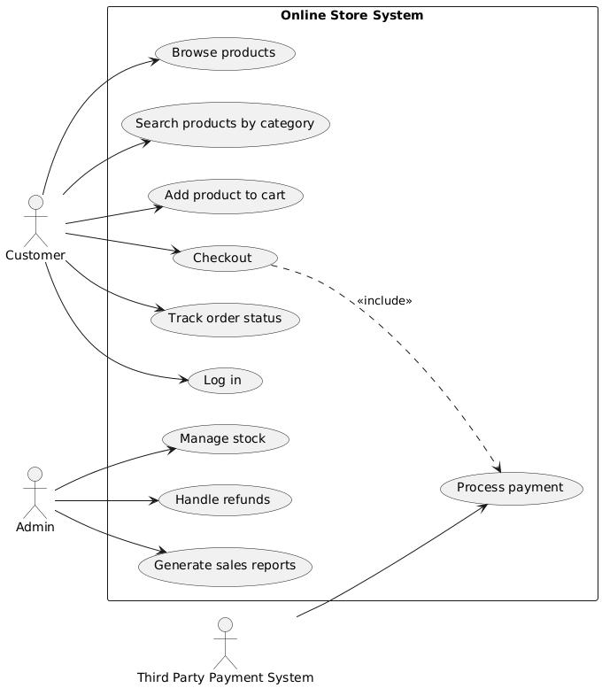

### Run 5

```plantuml
@startuml

left to right direction

actor Customer
actor Admin
actor "Third Party Payment System" <<system>>

rectangle "Online Store System" {
  usecase "Browse products" as UC_Browse
  usecase "Search products by category" as UC_Search
  usecase "Add product to cart" as UC_AddCart
  usecase "Checkout" as UC_Checkout
  usecase "Track order status" as UC_TrackOrder
  usecase "Log in" as UC_Login
  usecase "Process payment" as UC_Payment
  usecase "Manage stock" as UC_ManageStock
  usecase "Handle refunds" as UC_HandleRefunds
  usecase "Generate sales reports" as UC_SalesReports
}

Customer --> UC_Browse
Customer --> UC_Search
Customer --> UC_AddCart
Customer --> UC_Checkout
Customer --> UC_TrackOrder
Customer --> UC_Login

UC_Checkout ..> UC_Payment : <<include>>
"Third Party Payment System" --> UC_Payment

Admin --> UC_ManageStock
Admin --> UC_HandleRefunds
Admin --> UC_SalesReports

@enduml
```

### Structural Consistency: **CONSISTENT**

All 5 runs produce structurally identical output (same actors, use cases, and relationships).

---

## TC13: Library: Library System (Use Case Diagram)

### Run 1

```plantuml
@startuml

left to right direction

actor "Member" as Member
actor "Librarian" as Librarian

rectangle "Library System" {
  usecase "Search for books" as UC_Search
  usecase "Put book on hold" as UC_Hold
  usecase "Borrow book" as UC_Borrow
  usecase "Return book" as UC_Return
  usecase "Add new book" as UC_Add
  usecase "Remove old book" as UC_Remove
  usecase "Manage member account" as UC_Manage
  usecase "Handle late fees" as UC_Fees
  usecase "Notify member about reserved book availability" as UC_Notify
}

Member --> UC_Search
Member --> UC_Hold
Member --> UC_Borrow
Member --> UC_Return

Librarian --> UC_Add
Librarian --> UC_Remove
Librarian --> UC_Manage
Librarian --> UC_Fees

UC_Hold ..> UC_Notify : <<include>>

@enduml
```

### Run 2

```plantuml
@startuml

left to right direction

actor "Member" as Member
actor "Librarian" as Librarian

rectangle "Library System" {
  usecase "Search for books" as UC_Search
  usecase "Put book on hold" as UC_Hold
  usecase "Borrow book" as UC_Borrow
  usecase "Return book" as UC_Return
  usecase "Add new book" as UC_Add
  usecase "Remove old book" as UC_Remove
  usecase "Manage member account" as UC_ManageAccount
  usecase "Handle late fees" as UC_LateFees
  usecase "Notify member about reserved book availability" as UC_Notify
}

Member --> UC_Search
Member --> UC_Hold
Member --> UC_Borrow
Member --> UC_Return
Librarian --> UC_Add
Librarian --> UC_Remove
Librarian --> UC_ManageAccount
Librarian --> UC_LateFees
UC_Hold ..> UC_Notify : <<include>>

@enduml
```

### Run 3

```plantuml
@startuml

left to right direction

actor "Member" as Member
actor "Librarian" as Librarian

rectangle "Library System" {
  usecase "Search for books" as UC_Search
  usecase "Put book on hold" as UC_Hold
  usecase "Borrow book" as UC_Borrow
  usecase "Return book" as UC_Return
  usecase "Add new book" as UC_Add
  usecase "Remove old book" as UC_Remove
  usecase "Manage member account" as UC_Manage
  usecase "Handle late fees" as UC_Fees
  usecase "Notify member about reserved book availability" as UC_Notify
}

Member --> UC_Search
Member --> UC_Hold
Member --> UC_Borrow
Member --> UC_Return

Librarian --> UC_Add
Librarian --> UC_Remove
Librarian --> UC_Manage
Librarian --> UC_Fees

UC_Hold ..> UC_Notify : <<include>>

@enduml
```

### Run 4

```plantuml
@startuml

left to right direction

actor "Member" as Member
actor "Librarian" as Librarian

rectangle "Library System" {
  usecase "Search for books" as UC_Search
  usecase "Put book on hold" as UC_Hold
  usecase "Borrow book" as UC_Borrow
  usecase "Return book" as UC_Return
  usecase "Add new book" as UC_Add
  usecase "Remove old book" as UC_Remove
  usecase "Manage member account" as UC_ManageAccount
  usecase "Handle late fees" as UC_LateFees
  usecase "Notify member about reserved book availability" as UC_Notify
}

Member --> UC_Search
Member --> UC_Hold
Member --> UC_Borrow
Member --> UC_Return

Librarian --> UC_Add
Librarian --> UC_Remove
Librarian --> UC_ManageAccount
Librarian --> UC_LateFees

UC_Hold ..> UC_Notify : <<include>>

@enduml
```

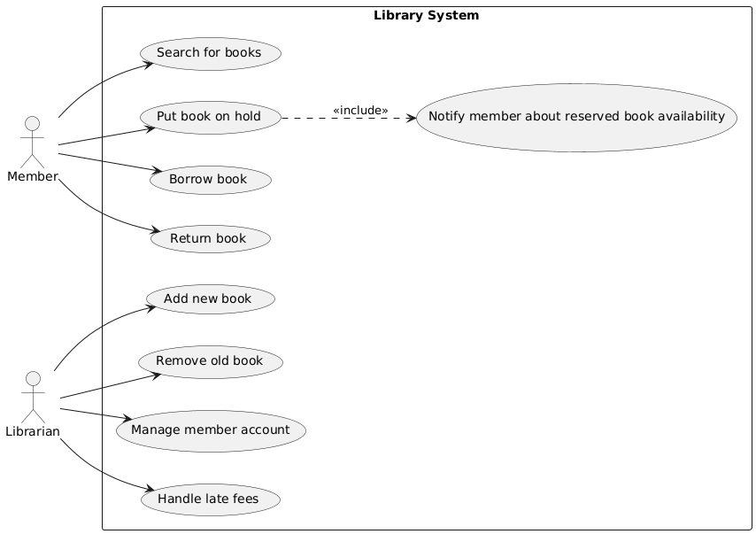

### Run 5

```plantuml
@startuml

left to right direction

actor "Member" as Member
actor "Librarian" as Librarian

rectangle "Library System" {
  usecase "Search for books" as UC_Search
  usecase "Put book on hold" as UC_Hold
  usecase "Borrow book" as UC_Borrow
  usecase "Return book" as UC_Return
  usecase "Add new book" as UC_Add
  usecase "Remove old book" as UC_Remove
  usecase "Manage member account" as UC_Manage
  usecase "Handle late fees" as UC_Fees
  usecase "Notify member about reserved book availability" as UC_Notify
}

Member --> UC_Search
Member --> UC_Hold
Member --> UC_Borrow
Member --> UC_Return

Librarian --> UC_Add
Librarian --> UC_Remove
Librarian --> UC_Manage
Librarian --> UC_Fees

UC_Hold ..> UC_Notify : <<include>>

@enduml
```

### Structural Consistency: **CONSISTENT**

All 5 runs produce structurally identical output (same actors, use cases, and relationships).

---

## TC14: Hospital: Hospital Appointment (Use Case Diagram)

### Run 1

```plantuml
@startuml

left to right direction

actor "Patient" as Patient
actor "Doctor" as Doctor
actor "Receptionist" as Receptionist
actor "Billing System" as BillingSystem <<system>>

rectangle "Hospital Appointment System" {
  usecase "Sign up as patient" as UC_SignUp
  usecase "View available times" as UC_ViewTimes
  usecase "Book an appointment" as UC_Book
  usecase "Cancel an appointment" as UC_Cancel
  usecase "Check schedule" as UC_CheckSchedule
  usecase "Mark appointment as done" as UC_MarkDone
  usecase "Manage calendar" as UC_ManageCalendar
  usecase "Sign up walk-in patient" as UC_SignUpWalkIn
  usecase "Send appointment reminders" as UC_SendReminders
  usecase "Process payment" as UC_ProcessPayment
}

Patient --> UC_SignUp
Patient --> UC_ViewTimes
Patient --> UC_Book
Patient --> UC_Cancel

Doctor --> UC_CheckSchedule
Doctor --> UC_MarkDone

Receptionist --> UC_ManageCalendar
Receptionist --> UC_SignUpWalkIn
Receptionist --> UC_SendReminders

UC_Book ..> UC_ProcessPayment : <<include>>
BillingSystem --> UC_ProcessPayment

@enduml
```

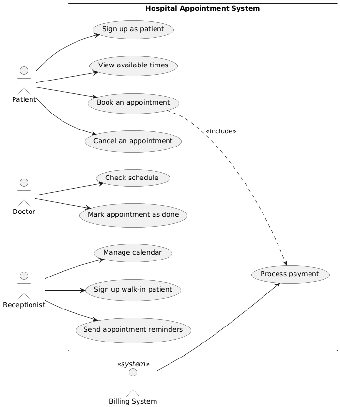

### Run 2

```plantuml
@startuml

left to right direction

actor "Patient" as Patient
actor "Doctor" as Doctor
actor "Receptionist" as Receptionist
actor "Billing System" as BillingSystem <<system>>

rectangle "Hospital Appointment System" {
  usecase "Sign up as patient" as UC_SignUp
  usecase "View available times" as UC_ViewTimes
  usecase "Book an appointment" as UC_Book
  usecase "Cancel an appointment" as UC_Cancel
  usecase "Check schedule" as UC_CheckSchedule
  usecase "Mark appointment as done" as UC_MarkDone
  usecase "Manage calendar" as UC_ManageCalendar
  usecase "Sign up walk-in patient" as UC_SignUpWalkIn
  usecase "Send appointment reminders" as UC_SendReminders
  usecase "Process payment" as UC_ProcessPayment
}

Patient --> UC_SignUp
Patient --> UC_ViewTimes
Patient --> UC_Book
Patient --> UC_Cancel

Doctor --> UC_CheckSchedule
Doctor --> UC_MarkDone

Receptionist --> UC_ManageCalendar
Receptionist --> UC_SignUpWalkIn
Receptionist --> UC_SendReminders

UC_Book ..> UC_ProcessPayment : <<include>>
BillingSystem --> UC_ProcessPayment

@enduml
```

### Run 3

```plantuml
@startuml

left to right direction

actor "Patient" as Patient
actor "Doctor" as Doctor
actor "Receptionist" as Receptionist
actor "Billing System" as BillingSystem <<system>>

rectangle "Hospital Appointment System" {
  usecase "Sign up as patient" as UC_SignUp
  usecase "View available times" as UC_ViewTimes
  usecase "Book an appointment" as UC_BookAppointment
  usecase "Cancel an appointment" as UC_CancelAppointment
  usecase "Check schedule" as UC_CheckSchedule
  usecase "Mark appointment as done" as UC_MarkDone
  usecase "Manage calendar" as UC_ManageCalendar
  usecase "Sign up walk-in patient" as UC_SignUpWalkIn
  usecase "Send appointment reminders" as UC_SendReminders
  usecase "Process payment" as UC_ProcessPayment
}

Patient --> UC_SignUp
Patient --> UC_ViewTimes
Patient --> UC_BookAppointment
Patient --> UC_CancelAppointment

Doctor --> UC_CheckSchedule
Doctor --> UC_MarkDone

Receptionist --> UC_ManageCalendar
Receptionist --> UC_SignUpWalkIn
Receptionist --> UC_SendReminders

UC_BookAppointment ..> UC_ProcessPayment : <<include>>
BillingSystem --> UC_ProcessPayment

@enduml
```

### Run 4

```plantuml
@startuml

left to right direction

actor "Patient" as Patient
actor "Doctor" as Doctor
actor "Receptionist" as Receptionist
actor "Billing System" as BillingSystem <<system>>

rectangle "Hospital Appointment System" {
  usecase "Sign up as patient" as UC_SignUp
  usecase "View available times" as UC_ViewTimes
  usecase "Book an appointment" as UC_Book
  usecase "Cancel an appointment" as UC_Cancel
  usecase "Check schedule" as UC_CheckSchedule
  usecase "Mark appointment as done" as UC_MarkDone
  usecase "Manage calendar" as UC_ManageCalendar
  usecase "Sign up walk-in patient" as UC_SignUpWalkIn
  usecase "Send appointment reminders" as UC_SendReminders
  usecase "Process payment" as UC_ProcessPayment
}

Patient --> UC_SignUp
Patient --> UC_ViewTimes
Patient --> UC_Book
Patient --> UC_Cancel

Doctor --> UC_CheckSchedule
Doctor --> UC_MarkDone

Receptionist --> UC_ManageCalendar
Receptionist --> UC_SignUpWalkIn
Receptionist --> UC_SendReminders

UC_Book ..> UC_ProcessPayment : <<include>>
BillingSystem --> UC_ProcessPayment

@enduml
```

### Run 5

```plantuml
@startuml

left to right direction

actor "Patient" as Patient
actor "Doctor" as Doctor
actor "Receptionist" as Receptionist
actor "Billing System" as BillingSystem <<system>>

rectangle "Hospital Appointment System" {
  usecase "Sign up as patient" as UC_SignUp
  usecase "View available times" as UC_ViewTimes
  usecase "Book an appointment" as UC_Book
  usecase "Cancel an appointment" as UC_Cancel
  usecase "Check schedule" as UC_CheckSchedule
  usecase "Mark appointment as done" as UC_MarkDone
  usecase "Manage calendar" as UC_ManageCalendar
  usecase "Sign up walk-in patient" as UC_SignUpWalkIn
  usecase "Send appointment reminders" as UC_SendReminders
  usecase "Process payment" as UC_ProcessPayment
}

Patient --> UC_SignUp
Patient --> UC_ViewTimes
Patient --> UC_Book
Patient --> UC_Cancel

Doctor --> UC_CheckSchedule
Doctor --> UC_MarkDone

Receptionist --> UC_ManageCalendar
Receptionist --> UC_SignUpWalkIn
Receptionist --> UC_SendReminders

UC_Book ..> UC_ProcessPayment : <<include>>
BillingSystem --> UC_ProcessPayment

@enduml
```

### Structural Consistency: **CONSISTENT**

All 5 runs produce structurally identical output (same actors, use cases, and relationships).

---

## TC15: ELearning: E-Learning Platform (Use Case Diagram)

### Run 1

```plantuml
@startuml

left to right direction

actor "Student" as Student
actor "Teacher" as Teacher
actor "Admin" as Admin

rectangle "Online Learning Platform" {
  usecase "Browse courses" as UC_BrowseCourses
  usecase "Sign up for course" as UC_SignUp
  usecase "Watch course videos" as UC_WatchVideos
  usecase "Submit homework" as UC_SubmitHomework
  usecase "Take quizzes" as UC_TakeQuizzes
  usecase "Receive certificate for course completion" as UC_ReceiveCertificate
  usecase "Create course" as UC_CreateCourse
  usecase "Upload course materials" as UC_UploadMaterials
  usecase "Grade student work" as UC_GradeWork
  usecase "Post announcements" as UC_PostAnnouncements
  usecase "Manage user accounts" as UC_ManageAccounts
  usecase "Approve courses" as UC_ApproveCourses
  usecase "Track platform usage" as UC_TrackUsage
}

Student --> UC_BrowseCourses
Student --> UC_SignUp
Student --> UC_WatchVideos
Student --> UC_SubmitHomework
Student --> UC_TakeQuizzes
Student --> UC_ReceiveCertificate

Teacher --> UC_CreateCourse
UC_CreateCourse ..> UC_UploadMaterials : <<include>>
Teacher --> UC_GradeWork
Teacher --> UC_PostAnnouncements

Admin --> UC_ManageAccounts
Admin --> UC_ApproveCourses
Admin --> UC_TrackUsage

@enduml
```

### Run 2

```plantuml
@startuml

left to right direction

actor "Student" as Student
actor "Teacher" as Teacher
actor "Admin" as Admin

rectangle "Online Learning Platform" {
  usecase "Browse courses" as UC_BrowseCourses
  usecase "Sign up for course" as UC_SignUp
  usecase "Watch course videos" as UC_WatchVideos
  usecase "Submit homework" as UC_SubmitHomework
  usecase "Take quizzes" as UC_TakeQuizzes
  usecase "Receive certificate for course completion" as UC_ReceiveCertificate
  
  usecase "Create course" as UC_CreateCourse
  usecase "Upload course materials" as UC_UploadMaterials
  usecase "Grade student work" as UC_GradeWork
  usecase "Post announcements" as UC_PostAnnouncements
  
  usecase "Manage user accounts" as UC_ManageAccounts
  usecase "Approve courses" as UC_ApproveCourses
  usecase "Track platform usage" as UC_TrackUsage
}

Student --> UC_BrowseCourses
Student --> UC_SignUp
Student --> UC_WatchVideos
Student --> UC_SubmitHomework
Student --> UC_TakeQuizzes
Student --> UC_ReceiveCertificate

Teacher --> UC_CreateCourse
UC_CreateCourse ..> UC_UploadMaterials : <<include>>
Teacher --> UC_GradeWork
Teacher --> UC_PostAnnouncements

Admin --> UC_ManageAccounts
Admin --> UC_ApproveCourses
Admin --> UC_TrackUsage

@enduml
```

### Run 3

```plantuml
@startuml

left to right direction

actor "Student" as Student
actor "Teacher" as Teacher
actor "Admin" as Admin

rectangle "Online Learning System" {
  usecase "Browse courses" as UC_BrowseCourses
  usecase "Sign up for a course" as UC_SignUp
  usecase "Watch course videos" as UC_WatchVideos
  usecase "Submit homework" as UC_SubmitHomework
  usecase "Take quizzes" as UC_TakeQuizzes
  usecase "Receive certificate for course completion" as UC_ReceiveCertificate
  usecase "Create a course" as UC_CreateCourse
  usecase "Upload course materials" as UC_UploadMaterials
  usecase "Grade student work" as UC_GradeWork
  usecase "Post announcements" as UC_PostAnnouncements
  usecase "Manage user accounts" as UC_ManageAccounts
  usecase "Approve courses" as UC_ApproveCourses
  usecase "Track platform usage" as UC_TrackUsage
}

Student --> UC_BrowseCourses
Student --> UC_SignUp
Student --> UC_WatchVideos
Student --> UC_SubmitHomework
Student --> UC_TakeQuizzes
Student --> UC_ReceiveCertificate

Teacher --> UC_CreateCourse
UC_CreateCourse ..> UC_UploadMaterials : <<include>>
Teacher --> UC_GradeWork
Teacher --> UC_PostAnnouncements

Admin --> UC_ManageAccounts
Admin --> UC_ApproveCourses
Admin --> UC_TrackUsage

@enduml
```

### Run 4

```plantuml
@startuml

left to right direction

actor "Student" as Student
actor "Teacher" as Teacher
actor "Admin" as Admin

rectangle "Online Learning System" {
  usecase "Browse courses" as UC_Browse
  usecase "Sign up for course" as UC_SignUp
  usecase "Watch course videos" as UC_Watch
  usecase "Submit homework" as UC_Homework
  usecase "Take quizzes" as UC_Quizzes
  usecase "Receive certificate for course completion" as UC_Certificate

  usecase "Create course" as UC_Create
  usecase "Upload course materials" as UC_Upload
  usecase "Grade student work" as UC_Grade
  usecase "Post announcements" as UC_Announcements

  usecase "Manage user accounts" as UC_ManageUsers
  usecase "Approve courses" as UC_Approve
  usecase "Track platform usage" as UC_Track
}

Student --> UC_Browse
Student --> UC_SignUp
Student --> UC_Watch
Student --> UC_Homework
Student --> UC_Quizzes
Student --> UC_Certificate

Teacher --> UC_Create
UC_Create ..> UC_Upload : <<include>>
Teacher --> UC_Grade
Teacher --> UC_Announcements

Admin --> UC_ManageUsers
Admin --> UC_Approve
Admin --> UC_Track

@enduml
```

### Run 5

```plantuml
@startuml

left to right direction

actor "Student" as Student
actor "Teacher" as Teacher
actor "Admin" as Admin

rectangle "Online Learning System" {
  usecase "Browse courses" as UC_BrowseCourses
  usecase "Sign up for course" as UC_SignUp
  usecase "Watch course videos" as UC_WatchVideos
  usecase "Submit homework" as UC_SubmitHomework
  usecase "Take quizzes" as UC_TakeQuizzes
  usecase "Receive certificate for completed course" as UC_ReceiveCertificate
  usecase "Create course" as UC_CreateCourse
  usecase "Upload course materials" as UC_UploadMaterials
  usecase "Grade student work" as UC_GradeWork
  usecase "Post announcements" as UC_PostAnnouncements
  usecase "Manage user accounts" as UC_ManageAccounts
  usecase "Approve courses" as UC_ApproveCourses
  usecase "Track platform usage" as UC_TrackUsage
}

Student --> UC_BrowseCourses
Student --> UC_SignUp
Student --> UC_WatchVideos
Student --> UC_SubmitHomework
Student --> UC_TakeQuizzes
Student --> UC_ReceiveCertificate

Teacher --> UC_CreateCourse
UC_CreateCourse ..> UC_UploadMaterials : <<include>>
Teacher --> UC_GradeWork
Teacher --> UC_PostAnnouncements

Admin --> UC_ManageAccounts
Admin --> UC_ApproveCourses
Admin --> UC_TrackUsage

@enduml
```

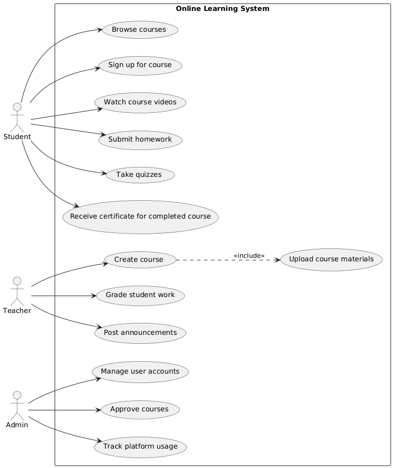

### Structural Consistency: **CONSISTENT**

All 5 runs produce structurally identical output with only alias naming differences across runs.

---

## Consistency Summary

- **Consistent**: 11 / 15 test cases (73.3%)
- **Inconsistent**: 4 / 15 test cases
- **Hallucination rate**: 0 hallucinated elements across 75 runs (95% CI: [0%, 4%], Rule of Three)

Paper reports 86.7% structural consistency (95% Wilson CI: [62%, 96%]).
