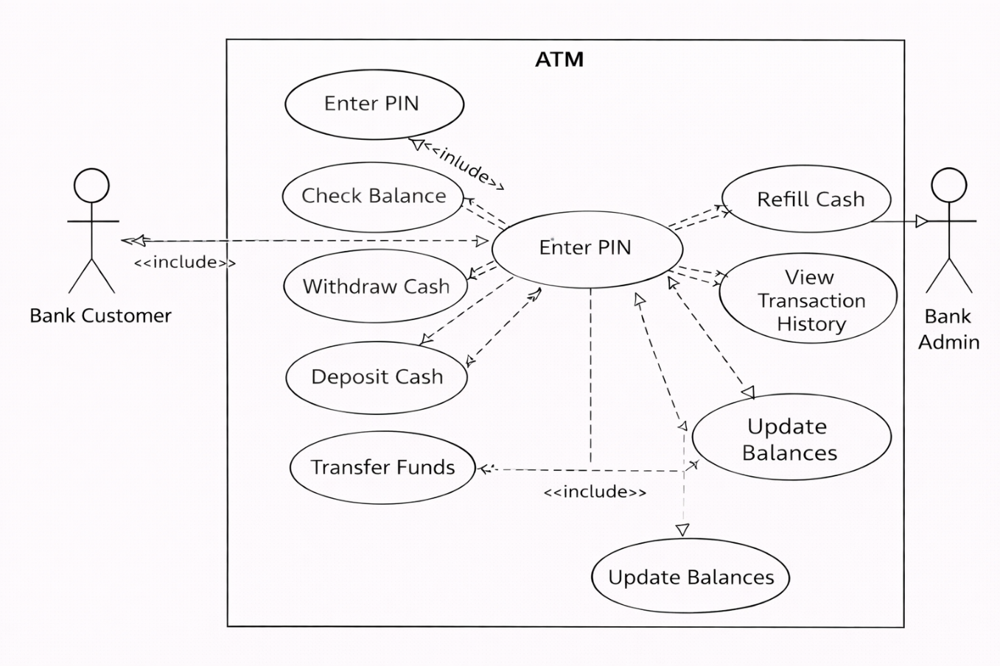
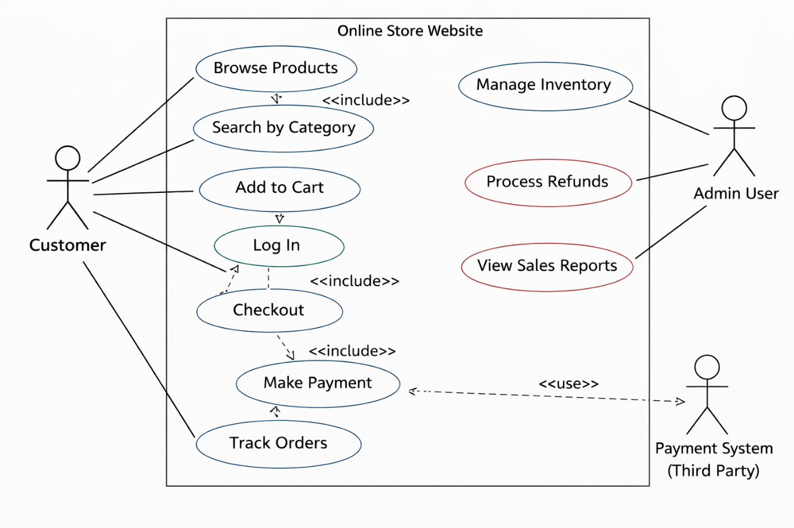
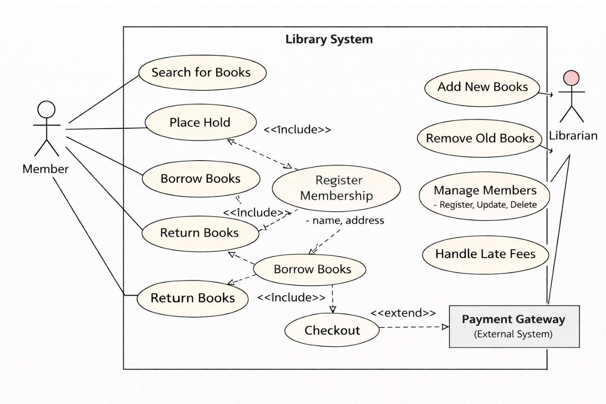
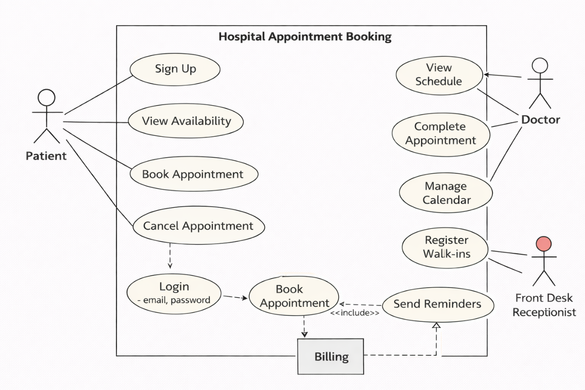
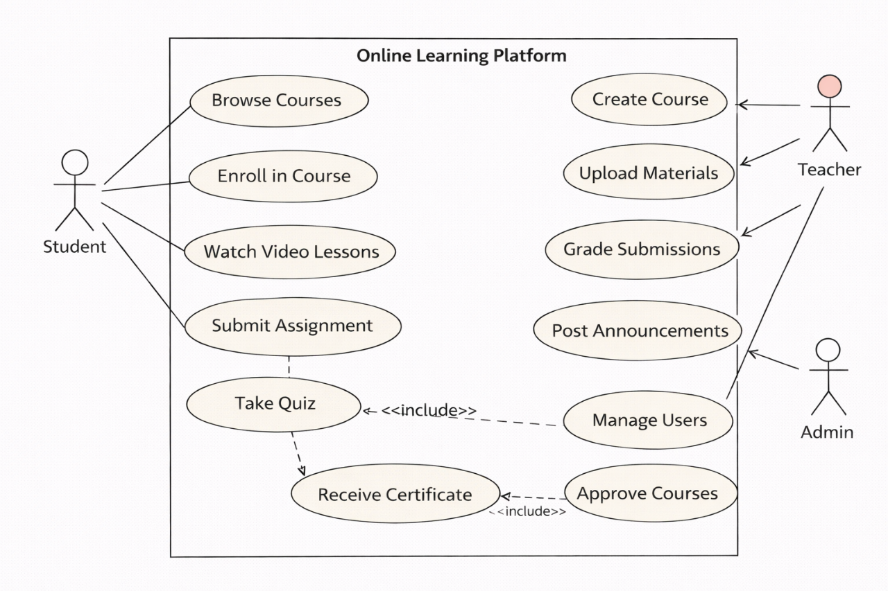

# ChatGPT DALL-E — Use Case Diagram Results

Generated using ChatGPT web interface (chatgpt.com) with GPT-5.2 Thinking + DALL-E image generation.

**Note:** DALL-E generates images directly — no source code is available.

## TC11: ATM: ATM System

### Generated Diagram

---

## TC12: OnlineStore: Online Store

### Generated Diagram

---

## TC13: Library: Library System

### Generated Diagram

---

## TC14: Hospital: Hospital Appointment

### Generated Diagram

---

## TC15: ELearning: E-Learning Platform

### Generated Diagram

---
