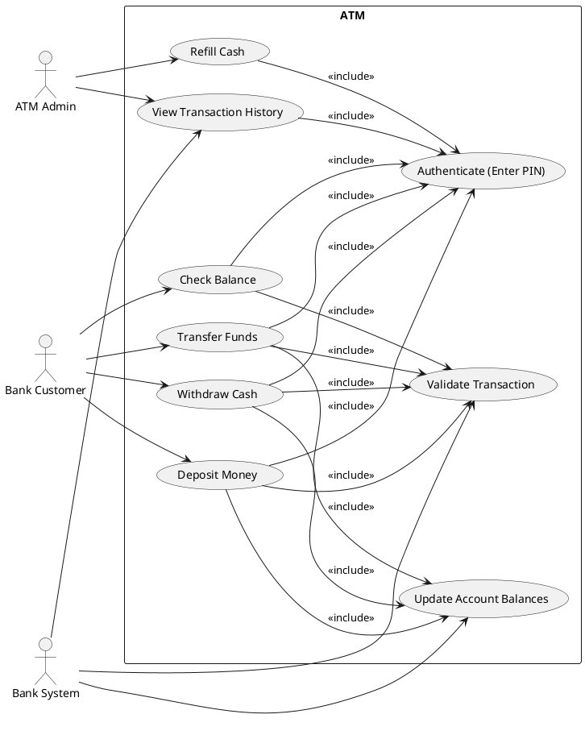
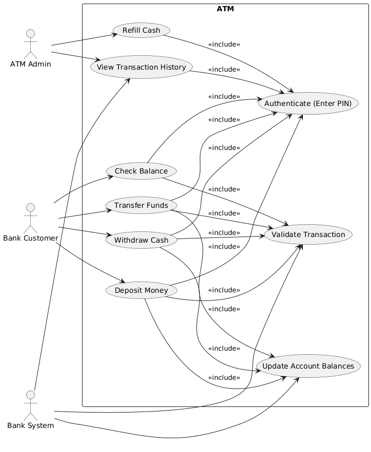
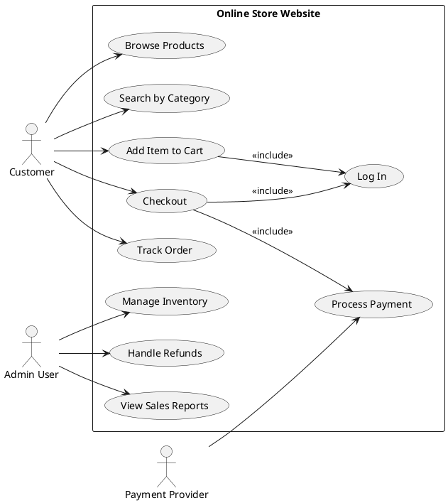
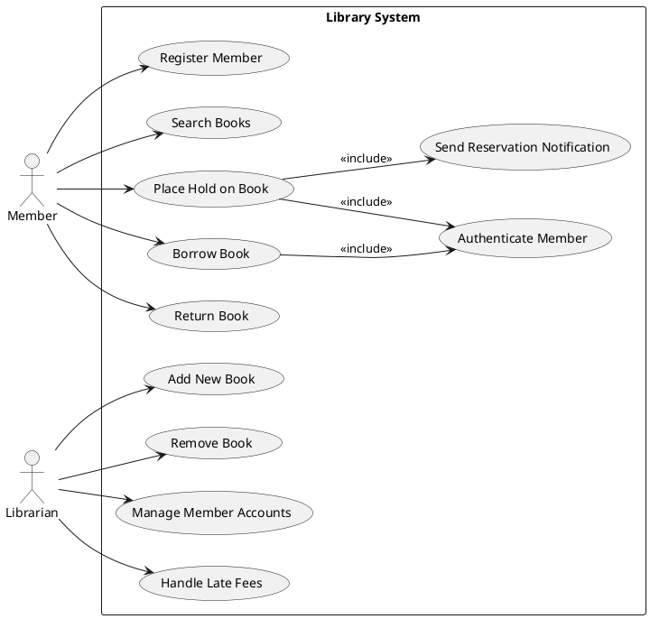
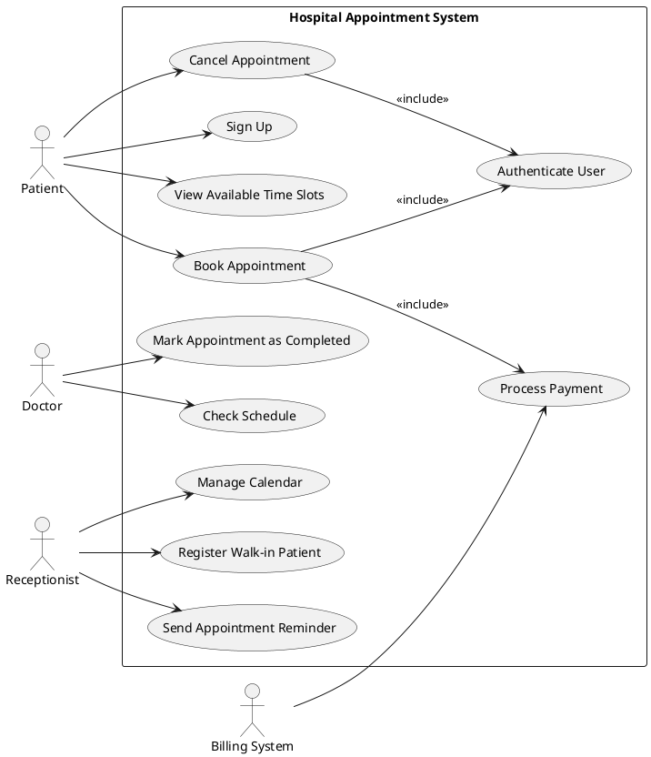
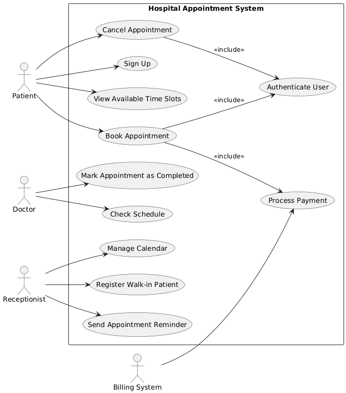
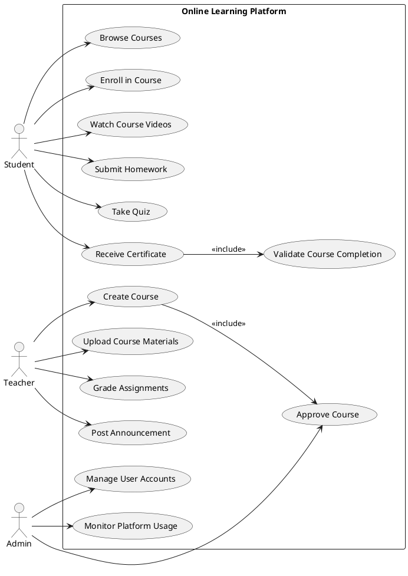
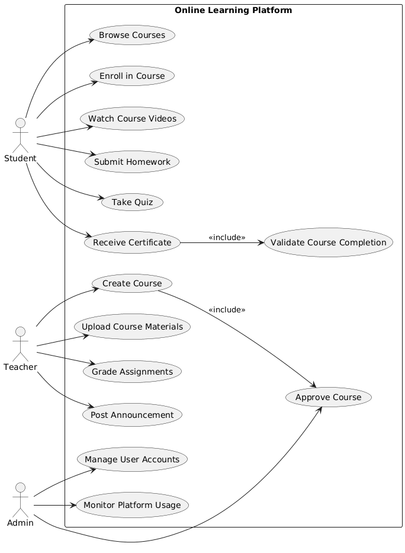

# ChatGPT PlantUML — Use Case Diagram Results

Generated using ChatGPT web interface (chatgpt.com) with GPT-5.2 Thinking, prompted: "Generate PlantUML code for a use case diagram based on these requirements. Return only the code between @startuml and @enduml." Code was then rendered via plantuml.com.

## TC11: ATM: ATM System

### PlantUML Code

### Generated Diagram

---

## TC12: OnlineStore: Online Store

### PlantUML Code

### Generated Diagram

---

## TC13: Library: Library System

### PlantUML Code

### Generated Diagram

---

## TC14: Hospital: Hospital Appointment

### PlantUML Code

### Generated Diagram

---

## TC15: ELearning: E-Learning Platform

### PlantUML Code

### Generated Diagram

---
