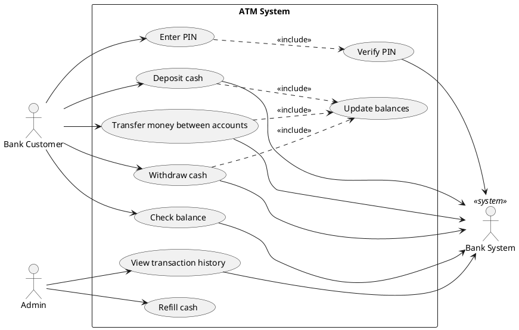
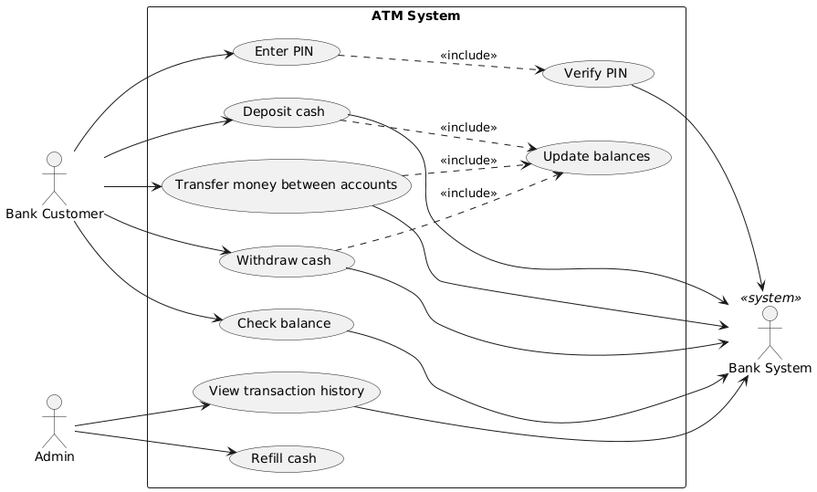
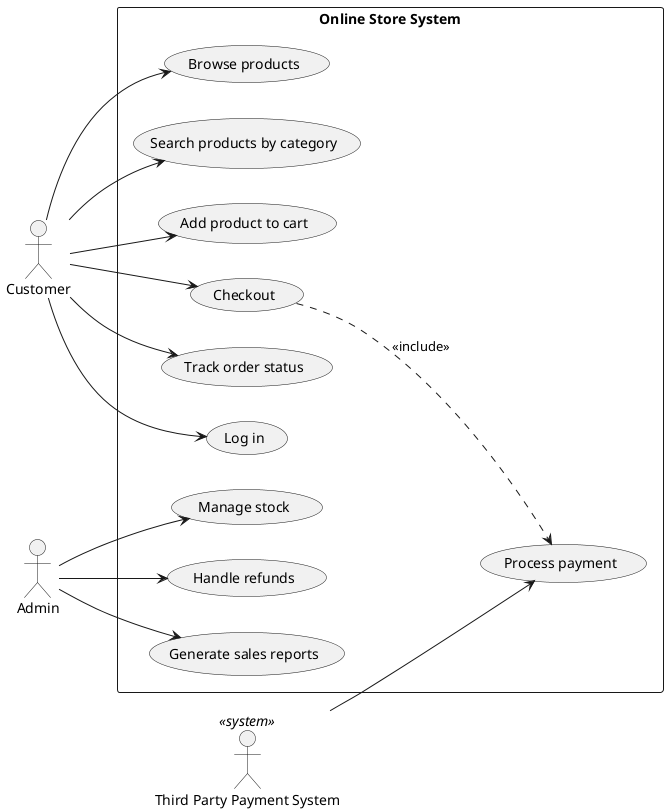
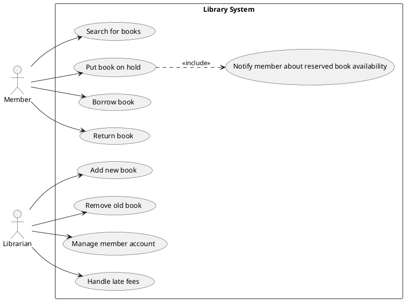
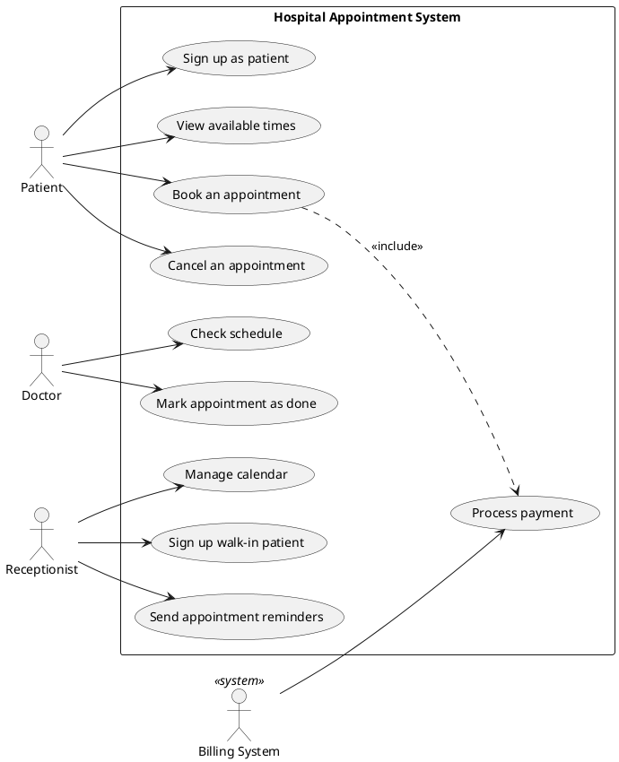
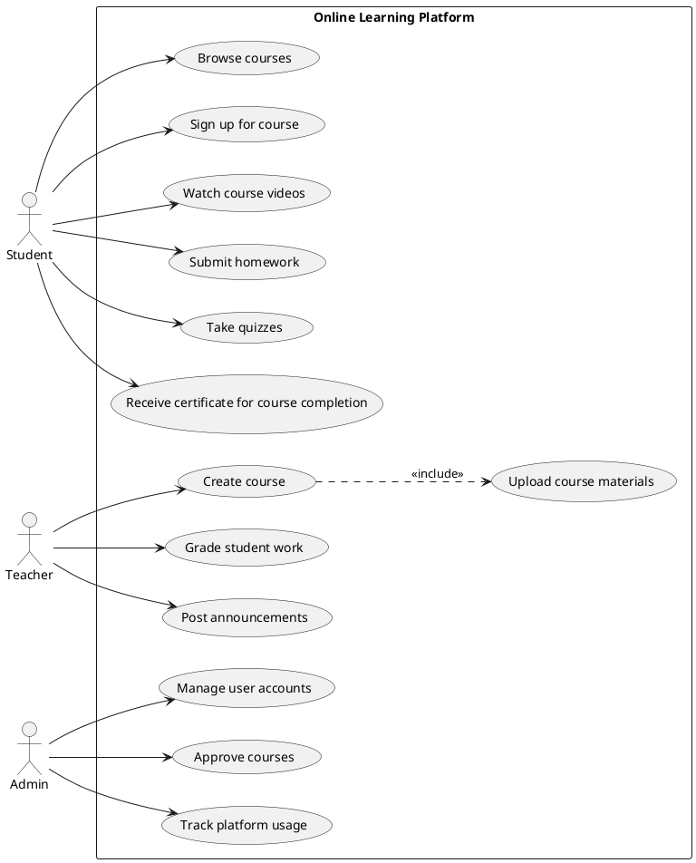
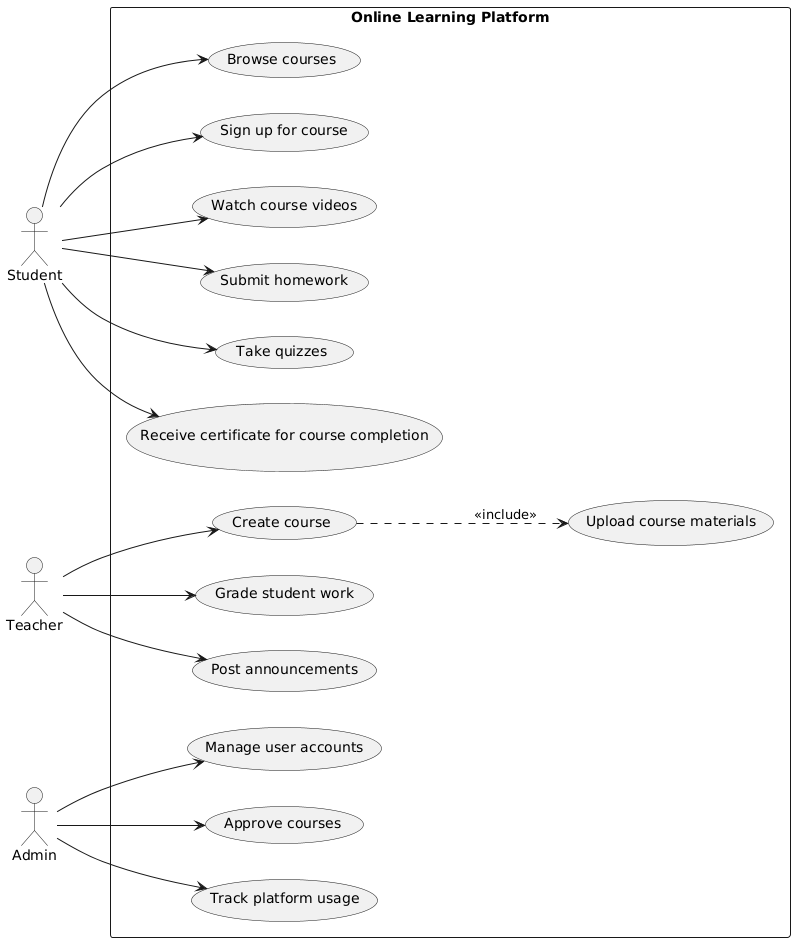

# UMLReq System — Use Case Diagram Results

Generated using GPT-4o (gpt-4o-2024-11-20) via OpenAI API with temperature=0.3, top_p=1.0, RAG grounding in PlantUML documentation, and methodology-aware prompts (Cockburn's goal-level taxonomy, Jacobson's actor classification).

## TC11: ATM: ATM System

### PlantUML Code

### Generated Diagram

---

## TC12: OnlineStore: Online Store

### PlantUML Code

### Generated Diagram

---

## TC13: Library: Library System

### PlantUML Code

### Generated Diagram

---

## TC14: Hospital: Hospital Appointment

### PlantUML Code

### Generated Diagram

---

## TC15: ELearning: E-Learning Platform

### PlantUML Code

### Generated Diagram

---
